# a2b TAB app: User guide

For HVAC TAB technicians and project managers, in the field and in the office. For the short version, see
[QUICK_START.md](./QUICK_START.md). A one-page [Field cheat sheet](#field-cheat-sheet) is at the end.

The app fills in the a2b TAB workbook (revision 05) for you. You enter readings on your phone, tablet or laptop,
and the app writes them into the right cells of the `.xlsm` file. The workbook's own formulas, macros and
print layout stay as they are.

**Contents**

1. [Installing and working offline](#1-installing-and-working-offline)
2. [Projects](#2-projects)
3. [Equipment](#3-equipment)
4. [Filling in each unit type](#4-filling-in-each-unit-type)
5. [N/A, Not Avail. and Not Acc.](#5-na-not-avail-and-not-acc)
6. [Issues](#6-issues)
7. [Photos](#7-photos)
8. [Exports](#8-exports)
9. [Follow-up: re-importing an issued workbook](#9-follow-up-re-importing-an-issued-workbook)
10. [Review, issuing the report, and History](#10-review-issuing-the-report-and-history)
11. [Coming later](#11-coming-later)
12. [Troubleshooting and FAQ](#12-troubleshooting-and-faq)
13. [Field cheat sheet](#field-cheat-sheet)

---

## 1. Installing and working offline

### Install it as an app

There's no App Store or Play Store listing. You add the web app to your home screen instead. Open the app link
your office sent you.

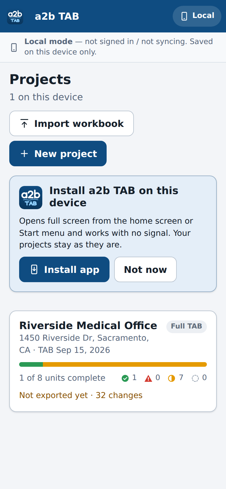

The **Projects** screen offers it for you:

- **Android, or Chrome / Edge on a laptop:** a card **Install a2b TAB on this device** with an **Install app**
  button. Tap it, then **Install** in the browser's dialog.
- **iPhone / iPad:** the card explains the two taps instead (iOS has no install button): **Share** → **Add to Home
  Screen**.

**Not now** / **Got it** hides the card on that device. It also disappears once the app is installed. If you
dismissed it, or the card doesn't show, use the browser menu:

| Device | Browser | Steps |
|---|---|---|
| iPhone / iPad | **Safari** (required on iOS) | Tap **Share** (square with an up arrow) → scroll down → **Add to Home Screen** → **Add**. |
| Android phone / tablet | **Chrome** | Tap **⋮** (top right) → **Install app** (some phones say **Add to Home screen**) → **Install**. |
| Windows / Mac laptop | **Chrome** or **Edge** | Click the install icon at the right end of the address bar, or open the browser menu → **Install a2b TAB** (Edge: **Apps → Install this site as an app**). |

The app shows up as **a2b TAB** (or **TAB**) with its own icon and opens full-screen, with no browser bars.

> **iPhone/iPad:** the home-screen app and Safari keep **separate** data. A project created in the home-screen app
> won't show up if you open the same link in a Safari tab, and the reverse is also true. Pick the home-screen app
> and stick with it.

### Working offline

Once the app has been opened one time with a connection, everything works with no signal: projects, forms, photos,
the workbook export and the PDF reports. It all runs on your device. Roofs and basements are fine.

### The Local-mode banner

Right now every screen shows:

> **Local mode** — not signed in / not syncing. Saved on this device only.

The header also has a **Local** pill. This means:

- **Microsoft sign-in and cloud sync are not live yet.** They're planned. When they arrive, the header will offer
  **Sign in with Microsoft**, and the pill will show **Synced**, **N unsynced** or **Offline**.
- **"Saved on this device only"** means exactly that. Your projects live in the app's storage on this phone,
  tablet or laptop. Another tech's phone can't see them, the office can't see them, and nothing is backed up
  anywhere.
- Every change is still logged, so when sync is turned on later, nothing you entered is lost.

### Backing up: export

Until sync is live, **the exported workbook is your backup**. Export at the end of each site day and save the file
to the project's Dropbox folder (see [Exports](#8-exports)). If a phone is lost, broken or reset, you can bring the
project back from that file with **Import workbook** on the Projects screen. Photos aren't in the workbook, so
also save the **Photos (.zip)** when photos matter.

The app keeps count for you:

- Each project card on the **Projects** screen, and the **Export** tab (**Last export**), show *Last exported Sep 24,
  2026, 3:10 PM (Prelim) · 12 changes since*, or *Not exported yet · 9 changes*. It turns amber when there are
  changes that aren't in an export yet. A "change" is one saved edit (a field, a row, a photo, an issue…).
- When you **leave a project** (the back arrow to the Projects screen) with changes since the last export, the app
  asks **Export before you leave?**: **Go to Export**, **Leave without exporting**, or **Don't remind me again
  today** (for that project, on this device).

The reminder only works inside the app. Closing the app or the browser tab doesn't trigger it.

### Updates

The app updates itself. When a new version is published, it downloads in the background while you work. Then a
bar at the bottom says **Update available. Reload to use the new version; your entries are saved.**

- **Reload** switches to the new version right away. Everything you entered stays.
- **Later** hides the bar. The new version starts the next time you open the app after closing it fully.

It never reloads by itself, so a half-typed reading isn't lost. If something looks out of date, close the app fully
(swipe it away) and reopen it.

---

## 2. Projects

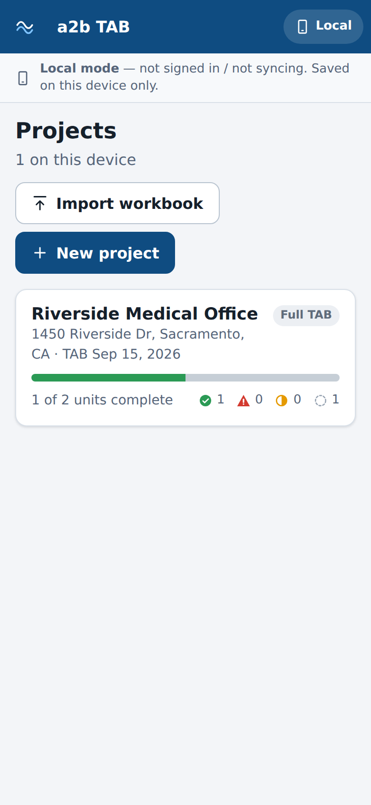

The **Projects** screen lists every project on this device, with its scope, address, TAB date, a progress bar and
counts of green / red / amber / gray units.

### Create a project

1. Tap **+ New project**.
2. Enter the **Project name** (required), **Physical address** and **TAB date**.
3. Pick a **Scope profile** (see below).
4. Tap **Create project**.

To bring in an existing workbook instead, tap **Import workbook** (see [section 9](#9-follow-up-re-importing-an-issued-workbook)).

Inside a project, the tabs are **Info**, **Equipment**, **Issues**, **Attention**, **Photos** and **Export**.

### Scope profiles

| Profile | What's required |
|---|---|
| **Full TAB** | Everything (the default). |
| **Airflow Only** | Identity, design CFM, airflow readings and the instrument. Unit data, motor, drive, RPM, static profile, misc. info and equipment photos are set to N/A for you. |
| **Custom** | You turn sections on or off yourself, per equipment type (Info → **Scope and tolerance**). |

You can change the profile later on **Info → Scope and tolerance → Scope profile**.

With **Custom**, the card lists every equipment type (RTUs, MAUs, ERVs, Fans, Small fans, VAVs, Hoods, Traverses).
Tap a type to open it, then tap a section chip to switch it off (or on again). The type's line shows e.g. *2 of 14
sections off*. A switched-off section shows **N/A (scope)** on every unit of that type.

On any unit, a section switched off by the scope can be switched back on with **⋮ → Include (override scope)**.

### Tolerance and report type

**Info → Scope and tolerance**:

- **Airflow tolerance (± % of design)**: ±5, ±10 (the standard), ±15 or ±20 %. This sets when a reading turns a
  unit red. It's also written to the workbook's Equipment Summary, so the printed "OK / Check" column matches the app.
- **Report**: **Preliminary** or **Final**.

### Project information

**Info → Project information**. Required: project name, physical address, mechanical engineer, mechanical
contractor, TAB date, technician(s), project manager, report date, and **Narrative: system set-up description**.
Optional: architect, electrical engineer, general contractor.

The status card at the top of **Info** lists everything still missing at the project level (project info,
narrative, cover photo, calibration, building pressures). Tap an item to jump to it.

### Blueprints used

**Info → Blueprints used**: up to 9 sheets, each with its **Revision date**. Tap **Add sheet** for another.

### Cover photo

**Info → Cover photo**: **Take photo** or **Choose**. It's placed on the workbook's Cover Page at export, cropped
to the photo box (a wide shape, about 1.7 : 1), so frame it wide. If this report has no cover photo, use the **N/A…**
menu next to *No cover photo for this report?*.

### Instruments and calibration

**Info → Instruments (Calibration sheet)**. New projects start with the **7 a2b instruments** from the template:

| Instrument | Make / model |
|---|---|
| Balometer | Evergreen Telemetry Three Pounder |
| Digital Micromanometer | Evergreen Telemetry S-PVF-1 |
| Laser Tachometer | Extech 461920 |
| Voltage/Amperage Multimeter | Fluke 902FC |
| Digital Temperature Tester | Fluke 52 Series II |
| Humidity Tester | Fluke 971 |
| Hydronic Pressure Measurement | Evergreen Telemetry S-DP-250 |

Edit any field, **Remove** what you didn't use, or **Add instrument** (8 slots, the Calibration sheet's limit).
When a **Calibration date** is more than 12 months before the TAB date, you'll see *More than 12 months before the
TAB date*, and the item appears on the **Attention** tab. Update the date or swap the instrument.

On unit, hood and traverse pages you pick the *kind* of instrument (Flow Hood, Velocity Grid, Pitot Traverse…). If no
calibration row covers that kind, you get an amber note.

### Building pressures

**Info → Building pressures (Building Balance)**:

- **Building vs Outdoors**: ΔP (required) and remarks.
- **Kitchen vs Dining**: ΔP, required only when the project has a hood. With no hoods it's N/A for you.
- **Spare pair (optional)**: your own test space / reference space, ΔP and remarks.
- Notes (up to 3 lines).

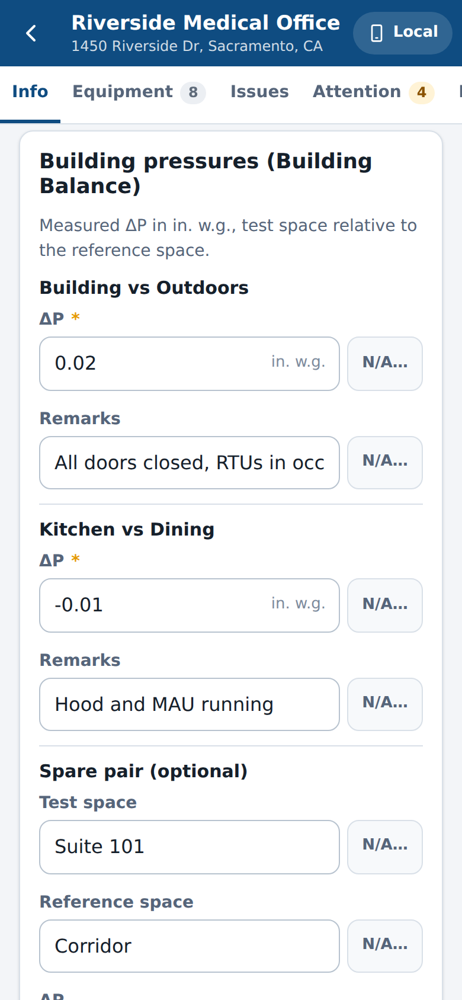

### Delete a project

**Info → Danger zone → Delete project** removes the project and everything in it **from this device**. Export first.

---

## 3. Equipment

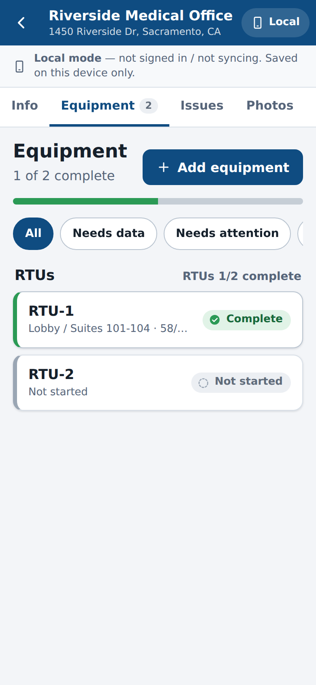

### Types and capacities

The workbook has a fixed number of slots for each type, and the app won't let you add past that number.

| Type (as shown in the app) | Designation | Capacity |
|---|---|---|
| RTUs (RTU / AHU / DOAS) | RTU- | 40 |
| MAUs (MAU / supply fan) | MAU- | 10 |
| ERVs | ERV- | 10 |
| Fans (EF, TF, KEF) | EF- | 40 |
| Small fans (direct drive under 1/6 hp) | EF-S | 40 (**Building Balance lists only 1–30**) |
| VAVs | VAV- | 80 |
| Hoods | H- | 20 |
| Traverses | T- | 48 |

Small fans 31–40 still go into the Small Fans sheet, but the Building Balance exhaust total leaves them out. The app
warns you when you go past 30.

### Add equipment

**Equipment → + Add equipment** → pick the type (each shows how many slots are used, e.g. *3 / 40 used*) → check or
change the **Designation** → **New** or **Existing** → **Add RTU-3**, or **Add & add another** to keep going.

**New / Existing** decides where the unit's issues go: New → *Summary - New*, Existing → *Summary - (E)*. You can
change it later on the unit page.

### Import a schedule

For long equipment lists, bring in the mechanical schedule instead of typing it: **Equipment → Import schedule**,
or **Import** next to a type heading (that picks the type for you).

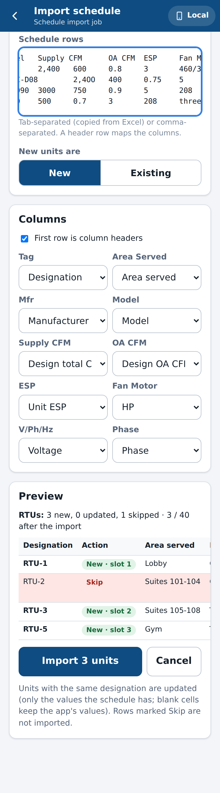

1. **Source**: pick one of
   - **Paste rows**: copy the schedule rows **with the header row** in Excel (or from a PDF table pasted into Excel)
     and paste them.
   - **CSV / Excel file**: a `.csv`, `.xlsx` or `.xlsm` file. If the file has several sheets, you pick one.
   - **TAB workbook**: an existing a2b workbook. Only its Equipment Data Entry section is read.
2. **New units are**: **New** or **Existing**.
3. **Columns**: the app matches headers such as *Tag*, *Mark*, *Mfr*, *Supply CFM*, *OA CFM*, *E.S.P.*, *V/Ph/Hz*.
   Check each dropdown, and change it or set it to *— ignore —*. Untick **First row is column headers** if there's
   no header row.
4. **Preview**: each row shows **New · slot N**, **Update** (that designation already exists), or **Skip** (with the
   reason: bad number, no designation, repeated designation, over capacity). Values like `1,200 CFM`, `1-1/2` and
   `460/3/60` are understood.
5. Tap **Import N units**.

Updating an existing unit only fills in the values the schedule has. Blank schedule cells never erase what's in the
app. Skipped rows aren't imported at all, so fix them and paste again.

### Duplicate a unit

At the bottom of a unit page: **Duplicate → Duplicate RTU-3**. The app suggests the next designation and shows
which workbook slot it will use. It copies the schedule and set-up data (unit type, drive, motor nameplate,
filters, instrument, method…) and, if you leave **Copy outlet / filter rows (without readings)** ticked, the outlet
rows without their readings. It never copies the serial number, readings, remarks or photos. Tap **Create RTU-4**.

### Status colors

Every unit card, type heading and project shows a status. Each one has its own icon shape as well as its color:

| Color | Label | Meaning |
|---|---|---|
| Gray (dashed circle) | **Not started** | Nothing entered yet. |
| Amber (half circle) | **In progress** | Some required items are still blank. **Show missing** on the unit lists them. |
| Green (check) | **Complete** | Every required item is filled in or marked N/A. |
| Red (triangle) | **Issue / tolerance** | The unit has an **open issue**, or a reading is **outside the tolerance** (e.g. ±10 % of design). The card says which: *1 open issue · 2 out of tolerance*. |
| Blue (square with a double check) | **Reviewed** | Complete, and signed off by a reviewer (see [section 10](#10-review-issuing-the-report-and-history)). |

A unit can be red even when all its data is filled in. Close the issue or re-check the reading to clear it.

The filter chips on the Equipment tab narrow the list:

| Chip | Shows |
|---|---|
| **All** | Every unit |
| **Needs data** | Units with required items still blank (and units not started) |
| **Issue / tolerance** | Red units only |
| **Complete** | Green units (reviewed or not) |
| **To review** | Complete units that aren't reviewed yet |
| **Reviewed** | Blue units |

Each type heading counts them too, e.g. *RTUs 5/8 complete, 3 reviewed*.

### The Attention tab

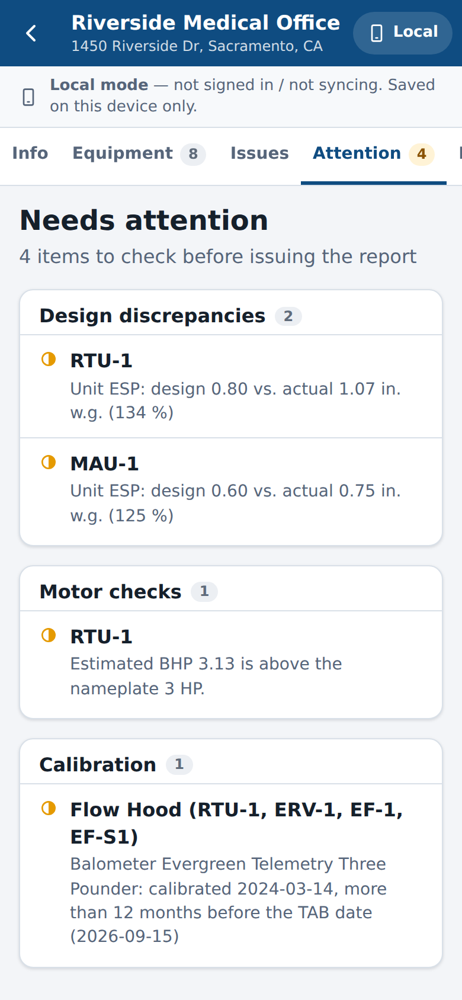

The **Attention** tab (with a count badge; also a **Needs attention** card at the top of Equipment) is your list of
things to check **before issuing the report**. It's wider than the red units: it also lists amber warnings. Everything on it is grouped, and each item opens the unit at the right section:

- readings out of tolerance
- open issues
- design discrepancies: the schedule design CFM doesn't match the sum of the outlet design CFMs, or the actual
  unit ESP is outside the tolerance of the design ESP
- motor checks: amps above corrected FLA × SF, estimated BHP above nameplate HP
- missing required photos (only on units you've started)
- calibration: an instrument used with no calibration row, or calibrated more than 12 months before the TAB date
- capacity: a type that's full, small fans past slot 30

Amber items are **warnings**. They don't block anything or change a unit's color.

---

## 4. Filling in each unit type

### How every unit page works

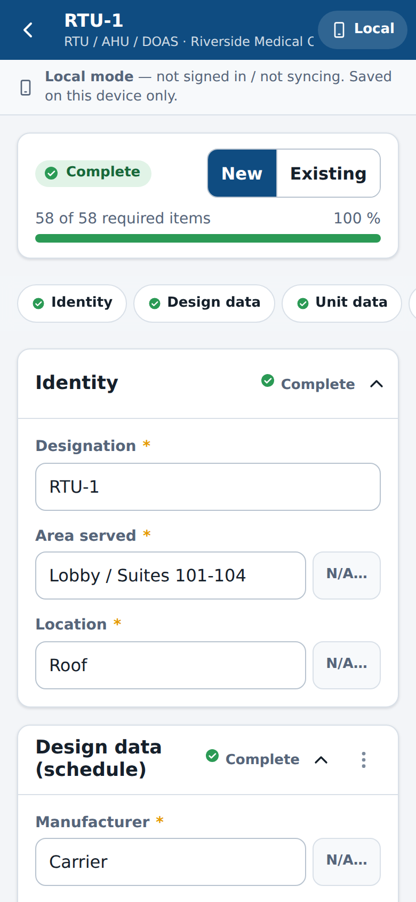

- **Top card**: the status, **New / Existing**, *N of M required items*, and any red or amber callouts
  (tolerance, open issues, discrepancies). **Show missing (N)** lists every blank required item as a link.
- **Section bar**: chips (**Identity**, **Design data**, **Unit data**…) with a status icon each. Tap one to jump
  to that section.
- **Sections** collapse and expand. Each has its own status and a **⋮** menu (section N/A).
- **Auto-save**: every field saves a moment after you stop typing and when you leave it. There's no Save button.
- A **\*** marks a required field.
- Number fields open the number keypad.

### Airflow rows (outlets, inlets, registers)

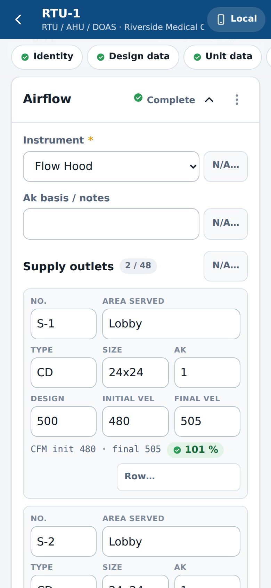

Each row has **No.**, **Area served**, **Type**, **Size**, **Ak**, **Design**, **Initial VEL** and **Final VEL**.
Under the row you see the calculated **CFM** (VEL × Ak) and **% of design**, in green or red.

- **Add outlet** (or *Add inlet*) copies area, type, size and Ak from the previous row, and numbers it S-1 → S-2.
- **Row…** menu: mark a column N/A / Not Avail. / Not Acc., **Duplicate row**, **Delete row**.
- A row counts as done with a reading in **either** Initial or Final, which fits prelim reports.

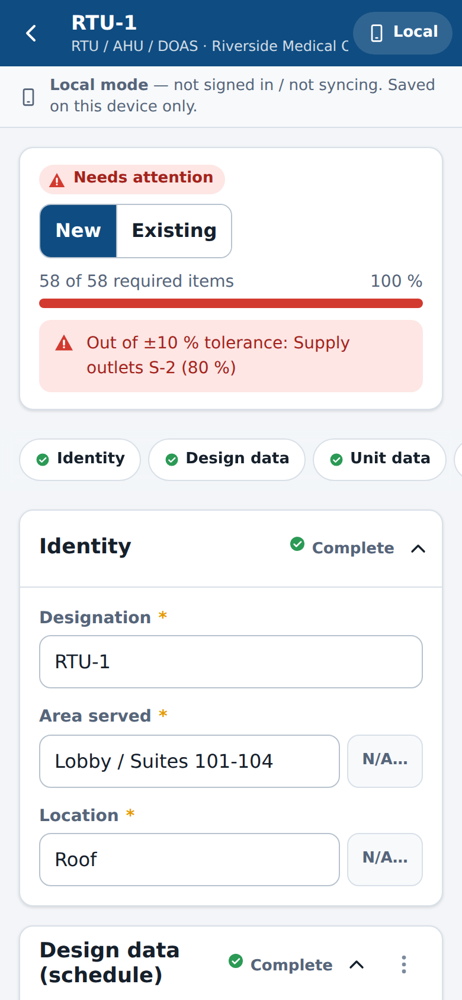

### RTU / AHU / DOAS

Sections: Identity · Design data (schedule) · Unit data · Motor data · Drive data · Misc. unit info · RPM data · OA
damper · Static pressure profile · Airflow · Photos · Remarks.

- **Unit type** (RTU or DOAS) sets which static-pressure components exist. RTU has no wheel, so *Leaving component
  2* shows *Auto N/A · not on this unit type*.
- **Drive type**: when it's Direct or ECM, the sheave / pulley / belt / C to C / bore fields are N/A for you.
- **VFD on the unit?**: when the answer is No, the VSD frequency fields are N/A.
- **Unit has filters?**: when the answer is No, the filter fields and filter static are N/A.
- **Design OA CFM** of 0 or blank makes the OA damper, the OA row and the OA damper photo N/A.
- **Phase** 1-phase makes volts / amps legs 2 and 3 N/A.
- **Airflow**: up to 48 supply outlets. Return inlets are optional. The OA row is required when there's design OA.

**Static pressure profile and motor panels** (RTUs, MAUs, ERVs, fans):

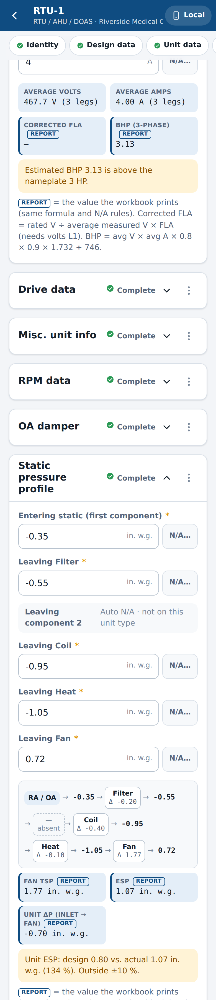

- Enter the entering static at the first component and the leaving static after each component. The strip shows
  each component's Δ, then **Fan TSP**, **ESP** (unit ESP actual) and **Unit ΔP (inlet → fan)**.
- Motor: **Average volts**, **Average amps**, **Corrected FLA** (rated V ÷ average measured V × FLA) and **BHP**
  (estimated).
- Values tagged **REPORT** are exactly what the workbook will print.
- **Amber warnings** (not errors, and they never change the color):
  - a measured amps leg above corrected FLA × service factor
  - *Estimated BHP … is above the nameplate … HP*
  - *Unit ESP: design … vs. actual … Outside ±10 %*

### MAU / supply fan

Same as RTU, but there's no OA damper and no OA / return rows. The **Supply airflow method** section has
**Method used**:

| Method | What you enter | What the app works out |
|---|---|---|
| **Outlets** | Instrument and outlet rows (up to 38) | CFM, % per row, total |
| **PSP** (perforated supply plenum) | Length, width (6–24 in.), number of blanks, up to 20 velocity readings | K-factor, average velocity, PSP CFM, CFM / ft |
| **Filter Grid** | Filter size and velocity for each filter (up to 11) | CFM (velocity × free area × 1.35) |
| **Profile Pressure** | Housing size (1–5), burner profile pressure (0.15–0.65 in. w.g.) | CFM from the manufacturer's curve |

Only the chosen method's inputs are required. The others become N/A. If you switch methods, your earlier entries are
kept in the app and come back when you switch back, but only the chosen method is exported. **Method total** is
checked against design (or against **Design CFM override** if you fill it in).

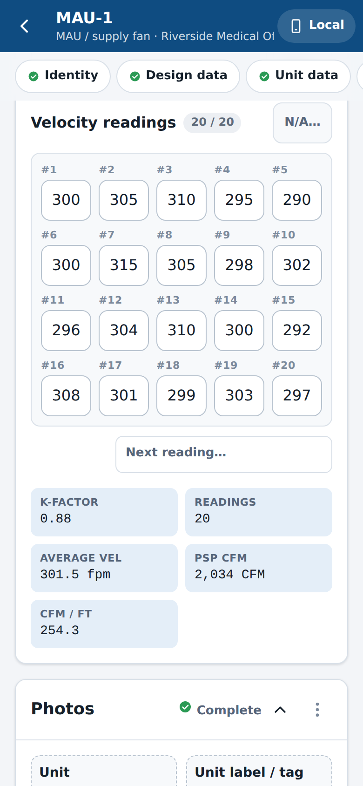

### ERV

Design supply / exhaust CFM and ΔP. **Primary (supply) airflow** with its supply instrument and outlets (up to 24),
**Secondary (exhaust) airflow** with its exhaust instrument and inlets (up to 24), and **Pressure drops (actual)**.
No OA damper. Static profile: Filter, Core, Fan.

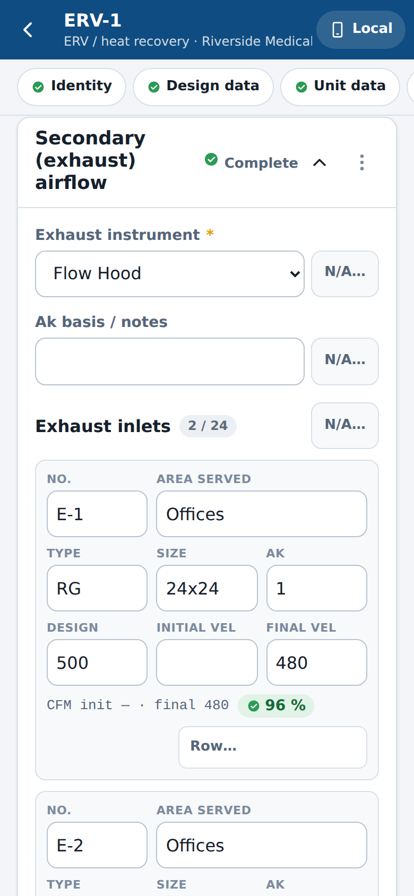

### Fans (EF, TF, KEF)

Like an RTU without OA. The static profile is just fan inlet (entering) and fan discharge (leaving). Airflow is
**Registers / grilles** (up to 56 rows).

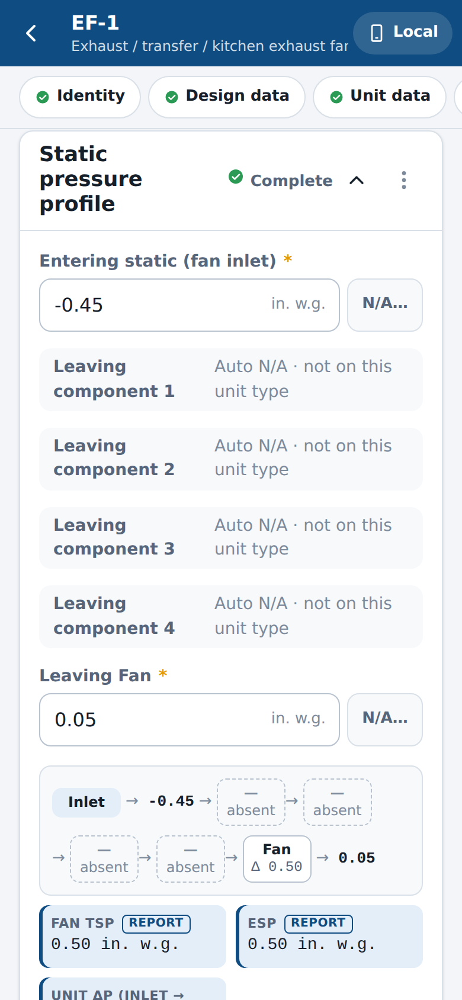

### Small fans

A short page (NEBB 5.3.6). Required: identity, manufacturer, model, **serial number**, **measured amps**, design CFM,
the instrument and at least one outlet row (up to 6), plus the **Unit / tag** photo. HP, voltage, phase, ESP, RPM
and speed settings are optional.

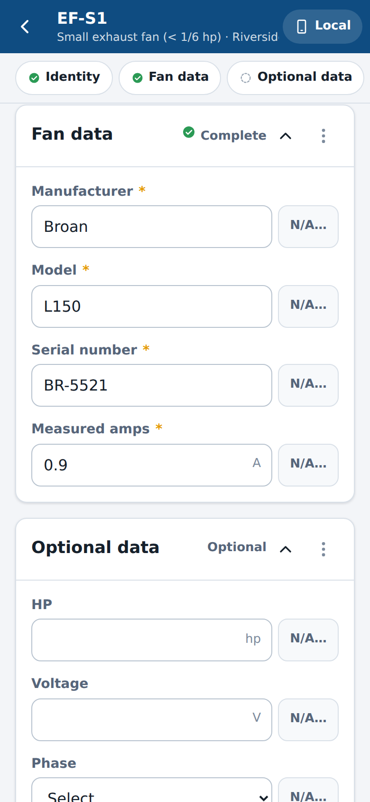

### VAVs

Design data (manufacturer, model, inlet size, terminal type, design max / min CFM, DDC address, plus heating and
fan CFM when scheduled), **Unit data** (serial, calibration factor, **DDC max / min**, e.g. "600 / 150"),
**Performance (actual)** and outlet rows (up to 6). Actual max comes from the outlet readings. Actual fan CFM is
N/A unless the terminal is fan-powered. Actual heating CFM is N/A unless heating CFM is scheduled.

### Hoods

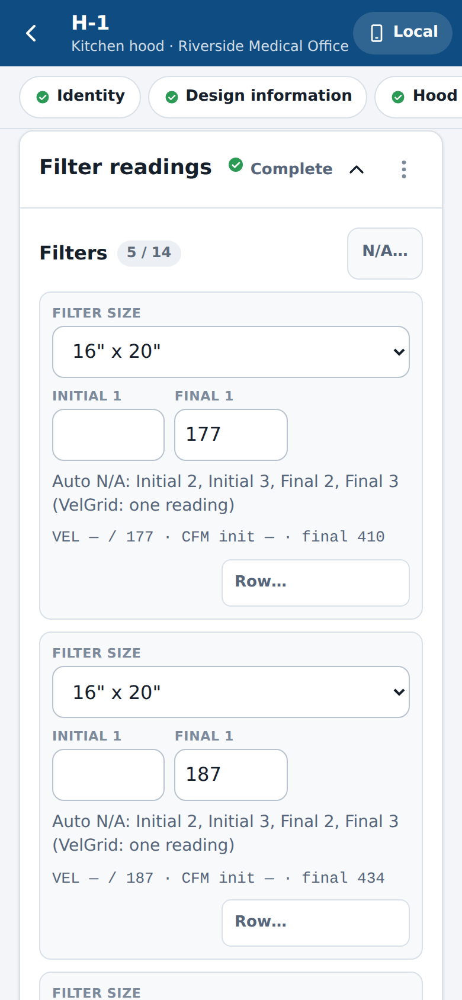

- **Design information**: hood manufacturer, design CFM, hood length, associated exhaust fan.
- **Hood data**: model, serial, hood type, filter manufacturer, **Filter type**, instrument.
- **Filter type** sets the free area, the K-factor, and how many readings each filter needs:
  - **VelGrid** types (Baffle, Captrate, Supply Filter): **1 reading** per filter. Readings 2 and 3 show *Auto N/A*.
  - **Airfoil** types (Condensate Baffle, HVC / Slot): **3 readings** per filter. The workbook averages them.
- **Filter size** only offers sizes that exist for the chosen filter type. **No Filter** makes that row N/A.
- Up to 14 filters. The app shows VEL and CFM per filter, the **Hood total**, % of design and CFM per ft.

### Traverses

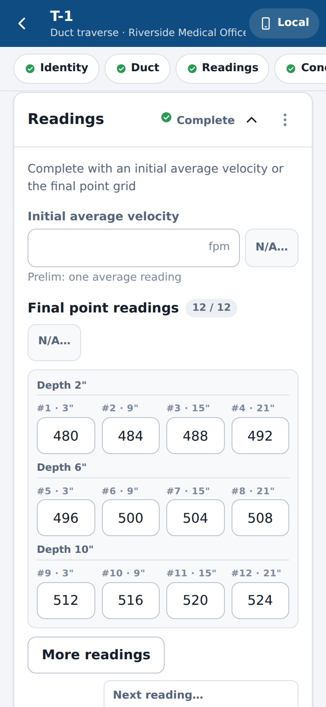

- **Identity**: point (T-#), area served, design CFM.
- **Duct**: **Duct shape** (Rectangular / Round), **Width / diameter**, **Height** (N/A for round), **Liner
  thickness** (optional). The app works out the size, Ak, number of points and insertion depths.
- **Readings**: either an **Initial average velocity** (one number, fine for a prelim) or the **Final point
  readings**, laid out in the calculated grid with each depth and position labeled.
  - **Quick entry**: type a reading, press **Enter** or **Next** on the keypad, and it moves to the next point.
  - **More readings** adds another row of points. **Next reading…** marks the next point N/A / Not Avail. / Not Acc.
  - You get a warning if you enter fewer readings than the calculated point count.
- **Conditions**: instrument, duct static pressure and temperature (all required).

---

## 5. N/A, Not Avail. and Not Acc.

**A blank field means "not done yet".** It keeps the unit amber. When something doesn't apply or can't be
measured, mark it:

| Mark | Meaning | Example |
|---|---|---|
| **N/A** | Not applicable | No economizer, so no OA damper position |
| **Not Avail.** | Not available | Nameplate missing or unreadable |
| **Not Acc.** | Not accessible | Unit above a hard lid, no ladder access |

These match the workbook's Abbreviations sheet.

### Where to mark it

| Level | How | Clear it |
|---|---|---|
| **Field** | **N/A…** next to the field → **Mark N/A** / **Mark Not Avail.** / **Mark Not Acc.** | **N/A…** → **Clear N/A** |
| **Airflow row column** | **Row…** → e.g. *Final VEL: Not Acc.* | **Row…** → **Clear N/A marks** |
| **Reading series** (PSP velocities, traverse points) | **N/A…** on the series, or **Next reading…** for one reading | same menu |
| **Section** | Section **⋮** → **Mark section N/A** (etc.) | **⋮** → **Clear section N/A** |
| **Whole unit** | Bottom of the unit page → **Whole unit N/A** | set it back to **Applies (not N/A)** |
| **Photo** | **N/A…** on the photo slot | same menu |

### Automatic N/A

The app marks things N/A itself when your other answers make them not apply. These show **Auto N/A** with the
reason. Examples: direct or ECM drive → belt and sheave data; no VFD → VSD frequency; design OA 0 → OA damper; 1-phase
→ legs 2 and 3; no filters → filter data; a component the unit type doesn't have; VAV not fan-powered → fan CFM;
MAU method not chosen; hood VelGrid → readings 2 and 3; No Filter → that row; round duct → height; no hoods →
Kitchen vs Dining. The scope profile shows **N/A for this scope**.

### How N/A prints in the workbook

Every N/A is written into the workbook as text. Marks you set print as the notation you chose (`N/A`, `Not Avail.`
or `Not Acc.`). Automatic and scope N/A print as `N/A`. The revision 05 formulas skip these cells in totals and
averages, so nothing shows an error, and **no cell is left blank to mean N/A**.

*One exception:* the leaving static of a component the unit type doesn't have (and the filter static on a unit with
no filters) is left **blank**, because the workbook reads a blank there as "component absent" and still calculates
the fan TSP and unit ΔP correctly.

---

## 6. Issues

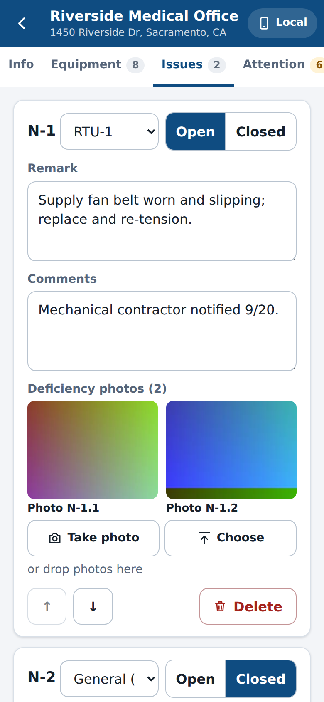

The **Issues** tab has two lists that feed two workbook sheets. They go to different parties, so they're numbered
separately:

| List | Numbered | Workbook sheet |
|---|---|---|
| **New equipment** | **N-1, N-2, N-3…** | Summary - New |
| **Existing equipment** | **E-1, E-2, E-3…** | Summary - (E) |

**Add new issue** or **Add existing issue**, then:

- **Equipment**: pick the unit, or **General (N/A)** for a building-wide issue. In the workbook, a linked issue's
  remark starts with the unit, e.g. `RTU-1: Supply fan belt worn…`.
- **Open / Closed**: an **open** issue turns its unit **red**. Close it when it's resolved.
- **Remark**: the deficiency, as it should read in the report.
- **Comments**: follow-up notes (e.g. "Mechanical contractor notified 9/20").
- **Deficiency photos**: **Take photo** / **Choose** (or drag and drop on a laptop). They're numbered to the issue:
  **Photo N-3.1**, **Photo N-3.2**, **Photo E-1.1**.
- **↑ / ↓** swaps an issue with its neighbor. Numbers and photo labels update everywhere.
- **Delete** removes the issue and its deficiency photos (it asks first).

The Issues tab count shows open issues.

---

## 7. Photos

### Taking photos

Every photo spot has **Take photo** (opens the camera) and **Choose** (camera roll or files; several at once where
it makes sense). On a laptop you can also drag photos in.

| Photo | Where | Required? |
|---|---|---|
| Cover | Info → Cover photo | Yes, or mark N/A |
| **Unit**, **Unit label / tag**, **OA damper** | Each unit → Photos section | Yes, unless marked N/A. OA damper only on units with OA. Small fans and VAVs: **Unit / tag**. Hoods: **Hood**, **Hood tag**. |
| Deficiency | Issues → the issue | Optional |
| Other / general | Photos tab → **Add photos** | Optional |

Photos are straightened (EXIF rotation), resized to a 2000-pixel long edge and saved as JPEG. That keeps them
sharp enough for the report while saving space. On iPhone, photos are converted from HEIC to JPEG as they're picked.
If a device ever says *This is a HEIC photo, which this browser cannot open*, set **Settings → Camera → Formats →
Most Compatible**.

### The Photos tab

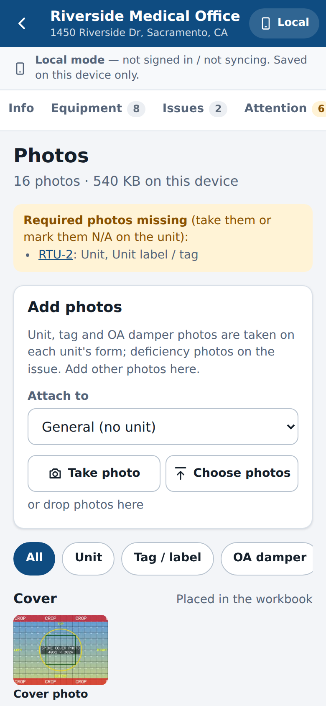

- **Required photos missing**: each unit that still needs photos, with a link to it. (Only units you've started.)
- **Add photos**: pick **Attach to** (a unit, or **General (N/A)** for a photo that isn't of one unit), then take
  or choose photos. Issues use the same words: an issue that isn't about one unit is linked to **General (N/A)**.
- Category filter chips, and thumbnails grouped by cover, unit, issue and general.
- Tap a photo to open it. There you can edit the **Caption**, change the **Category**, **Issue** or
  **Equipment**, move it **← Earlier** / **Later →** within its group, or **Delete** it.

### Storage on the phone

Photos are stored **inside the app on this device**, not in your camera roll, and not uploaded yet (cloud upload
comes with sync). The **Storage on this device** card shows how much space this project uses and whether storage is
**Persistent** (the device won't clear it to free space). If it says *Best effort*, make sure the app is installed
to the home screen and export the **Photos (.zip)** regularly.

Photos are **not** in the workbook, apart from the cover photo. They go into the Photo Report and the zip.

---

## 8. Exports

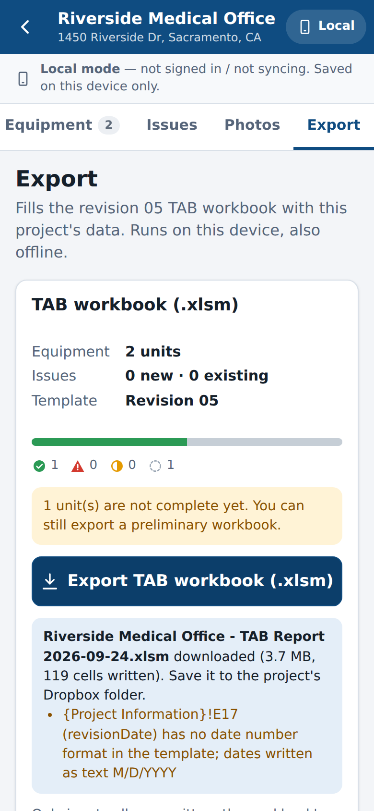

Everything on the **Export** tab runs on your device and works offline. Each export **downloads a file**. Nothing is
sent anywhere by itself.

### The TAB workbook (.xlsm)

1. **Export** tab → **TAB workbook (.xlsm)** card. It shows the equipment and issue counts, the template
   (**Revision 05**) and the status bar.
2. Check the **Revision** label. The app suggests **Prelim** first, then **Rev 1**, **Rev 2**… and you can type
   **Final** or anything else.
3. Tap **Export Prelim (.xlsm)** (the button shows the label).
4. The file `<Project> - TAB Report <date>.xlsm` downloads, and a box under the button confirms it.

You can export even when some units aren't complete. The app just notes that it's a preliminary workbook.

To send out the report *and* freeze the data, use **Issue report as Prelim** instead (see
[section 10](#issue-the-report-lock)). The plain **Export** button never locks anything, so use it for working copies
and daily backups.

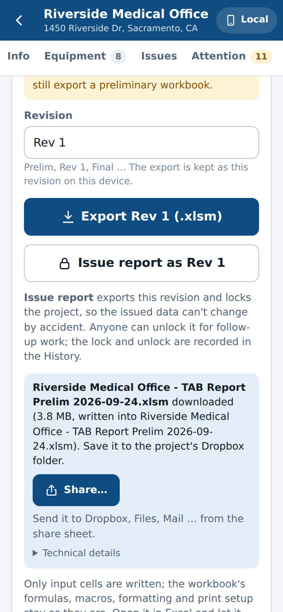

**Share… (phones).** Where the phone can share the file, the confirmation box has a **Share…** button. It opens the
phone's share sheet, so you can send the file straight to **Dropbox** (or Files, Mail, Teams…) without looking for
it in Downloads. iPhone and iPad can share every export (workbook, PDFs, zip). Android's Chrome can share the PDF
reports but not the `.xlsm` or `.zip` files. For those, and on laptops, the box shows **Download again** instead,
and you save the downloaded file as below.

The box also has a collapsed **Technical details** line (the number of cells written, and notes from the workbook
writer). You don't need it; it's there in case support asks.

Each export is kept as a **revision** in the **Revisions** list at the bottom of the tab, with its label, date and
size. You can download any of the newest 5 again from there. Older ones keep only their values, which is enough for
re-import. **The copy you saved to Dropbox is the official record.**

### Saving to Dropbox

The app has no Dropbox connection. You save the file yourself:

- **iPhone/iPad:** tap **Share…** in the export box → **Dropbox** (or **Save to Files** → **Dropbox**) → the project
  folder. Missed it? **Files** app → **Downloads**.
- **Android:** **Dropbox** app → **+** → **Upload files** → **Downloads** → the file. (Or share it from the download
  notification to Dropbox.)
- **Laptop:** move it from **Downloads** into the project's Dropbox folder.

### Opening it in Excel (macros)

The workbook is a macro-enabled `.xlsm` (for example, the table-of-contents button). The app only fills input cells.
Formulas, macros, formatting and print setup are left as they are.

- Open it in **desktop Excel**. If a yellow bar says **Macros have been disabled**, click **Enable Content**.
- If a red bar says Microsoft **blocked macros** because the file came from the internet, close the file,
  right-click it → **Properties** → tick **Unblock** → **OK**, and open it again.
- Let Excel recalculate on open. If it asks to save changes when you close, that's normal.
- Excel on a phone can show the workbook but won't run macros.

### Photo and Issues reports (PDF)

On the same tab, **Photo and Issues reports (PDF)**:

- **Report label**: the same as the workbook revision by default.
- **Photos per page**: **4 per page (2 × 2)** (standard), **2 per page (large)** or **6 per page (2 × 3)**.
- **Issues to include**: **All**, **New only** or **Existing only**. New and existing go to different parties, so
  you can export each on its own.
- **Include deficiency photos in the Photo Report**: tick or untick.

| Button | What you get |
|---|---|
| **Photo Report** | Photos grouped by unit, then General, each with its label (e.g. *RTU-1 · Unit*) and caption |
| **Issues Report** | New and / or Existing sections. Each issue shows its number, unit, OPEN / CLOSED, remark, comments and its deficiency photos underneath |
| **Issues + Photos** | The Issues Report followed by the Photo Report |
| **Photos (.zip)** | All photo files, named like `RTU-1 - Unit - 01.jpg`, `Issue N-3 - 1.jpg`, `Cover.jpg` |

Large reports take a moment. The button shows *Placing photo 12 of 80…* while it works. When it's done, the box
under the buttons names the file and offers **Share…** (or **Download again**), like the workbook. Save these to
Dropbox the same way.

---

## 9. Follow-up: re-importing an issued workbook

After a prelim goes out, the office often polishes remarks and fixes formatting in Excel. Re-import brings those
edits back into the app, so the next export includes them **and keeps the Excel formatting**.

### The workflow

1. **Export** the report (e.g. *Prelim*) and save it to Dropbox.
2. The office **edits the workbook in Excel**: remarks, comments, formatting, the occasional corrected reading.
   Save it as `.xlsm`.
3. Back in the app: **Export** tab → **Re-import workbook** → **Choose .xlsm file** → pick the edited file (from
   Files / Dropbox on a phone).
4. **Review changes** (below), then **Apply**.
5. Do the follow-up work in the app.
6. **Export Rev 1**. The app writes **into the issued workbook** instead of a blank template, so the Excel formatting
   carries forward. The Export card shows **Written into** with that file's name.

Use **Use the blank template instead** only if you want to start from a clean template again. Hand formatting is
then not carried over.

### The review screen

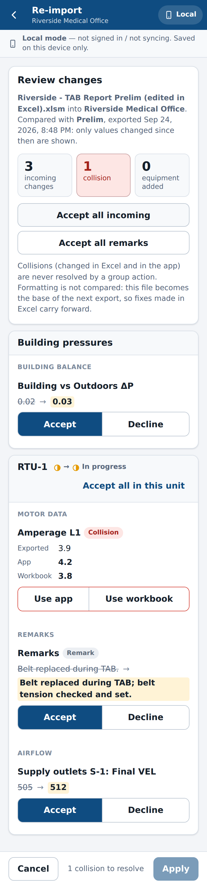

The app compares three versions: what it exported, what's in the app now, and what's in the file. It only shows
values that changed since that export.

- **Incoming change**: changed in Excel only. Shows old → new, **Accept** (the default) or **Decline**.
- **Collision**: the same value changed **in Excel and in the app** since the export. It shows the *Exported*,
  *App* and *Workbook* values, and you must pick **Use app** or **Use workbook**.
- **Remarks** are tagged *Remark*.
- Group buttons: **Accept all incoming**, **Accept all remarks**, **Accept all in this unit**. They never settle
  collisions for you.
- Each unit shows its color before and after the merge.
- Units removed in Excel are **declined** by default. Accept them only if you really want them deleted.
- **Apply** turns on once every collision is resolved. **Cancel** changes nothing.

Formatting is never compared, so it never shows up as a change or a collision. Photos stay as they are.

### Importing a workbook the app doesn't know

**Projects → Import workbook** (or a file exported from another device): if the file isn't linked to a project on this
device, choose **Create new project** or **Compare with project…**. A new project made this way has all the readings,
but **no photos** (photos aren't in the workbook), so units come back amber until photos are added.

---

## 10. Review, issuing the report, and History

### Review and sign-off (blue)

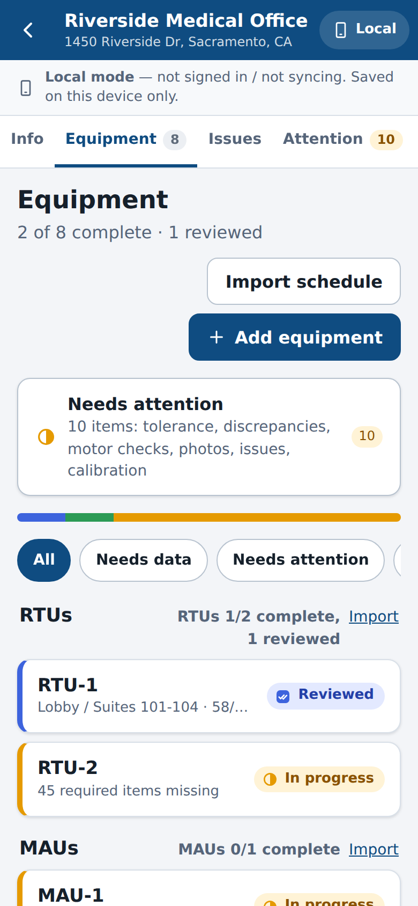

Anyone can sign off a **complete (green)** unit:

1. Open the unit. The status card at the top has a review line under the progress bar.
2. Type your name in **Reviewer name** (only the first time; the device remembers it) and tap **Mark reviewed**.
3. The unit turns **blue** (*Reviewed*), and the line says *Reviewed by Dana Ruiz · Sep 24, 2026, 3:10 PM*.

Until the unit is green, the line says *Can be marked reviewed once complete (green)*.

Where you see it:

- Unit cards and badges turn blue; the progress bars have a blue part.
- Counts: *RTUs 5/8 complete, 3 reviewed* on each type heading, *12 of 20 complete · 3 reviewed* on the Equipment
  tab and the project card, and *Reviewed: 3 of 20 units (2 complete, not reviewed)* on the Export tab.
- Filter chips **To review** (complete, not reviewed yet) and **Reviewed** on the Equipment tab.

**The review clears itself** when the unit changes after the sign-off: any field, N/A mark, New / Existing, an
outlet or filter row added, edited or removed, or a photo added or removed (also through a schedule import or a
re-import). The unit goes back to green and needs a new review. The History shows *Review cleared automatically
(the unit changed)*. Changes elsewhere in the project (tolerance, scope, other units) don't clear it.

If an **issue is opened** on a reviewed unit, the unit shows **red**, not blue, until the issue is closed. The
review line then says *Reviewed by … but the unit is no longer complete*. **Clear review** removes a review by hand.

### Issue the report (lock)

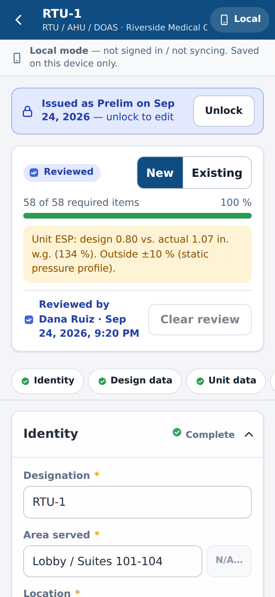

When a revision goes out (to the engineer, the GC…), issue it from the **Export** tab:

1. Check the **Revision** label (e.g. *Prelim*, *Rev 1*, *Final*).
2. Tap **Issue report as Prelim**, and confirm.
3. The workbook is exported and downloaded as that revision (like **Export**), marked **Issued** in the Revisions
   list, and the project is **locked**.

While the project is locked:

- Every project page shows the banner **Issued as Prelim on Sep 24, 2026 — unlock to edit** with an **Unlock**
  button, and the project card on the Projects screen shows a lock chip with the label (e.g. 🔒 *Prelim*).
- Forms are read-only (Info, units, Issues, Photos). **Add equipment**, **Import schedule** and **Re-import
  workbook** are hidden or blocked.
- You can still **export** (a copy of the workbook) and make the **PDF reports** and the **Photos (.zip)**, and you
  can view photos from the Photos tab.

**Unlock for follow-up** (the banner's **Unlock**, or the link on the Export tab): the confirm names the issued
revision and the label the next export will suggest, e.g. *Rev 1*. Anyone can unlock. The lock and the unlock
(who, when) are recorded in the History.

### History

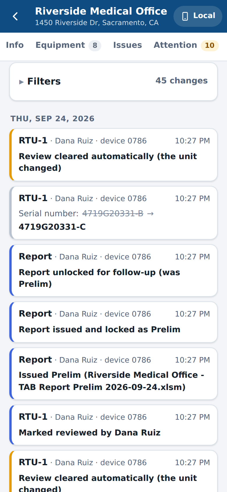

The **History** tab lists every change made to the project **on this device**, newest first, grouped by day:

- Edits read *Field: old → new*, e.g. *Serial number: 4719G20331-B → 4719G20331-C* or *Supply outlets S-2: Final
  VEL: 850 → 910*. Each line shows the unit (or *Report* / project), the person and device, and the time.
- Events: *Marked reviewed by Dana Ruiz*, *Review cleared automatically (the unit changed)*, *Report issued and
  locked as Prelim*, *Report unlocked for follow-up (was Prelim)*, *Issued Prelim (file name)*, re-imports.
- **Filters** (tap to open): **Unit** (or *Project-level only*), **Field** (text, e.g. *Final VEL*), **From** /
  **To** date, **User / device**. **Clear filters** resets them. The line shows how many changes match.
- **Show more** loads older entries.

Each unit page also has a **History** section at the bottom (**Show (N)**) with that unit's own changes, and a link to
the History tab filtered to the unit.

The history is kept on the device for **12 months** (at most 5,000 entries per project) and is deleted with the
project. Changes made on another phone aren't in it (each device has its own history until sync arrives).

---

## 11. Coming later

> **Later: Microsoft sign-in and cloud sync.** You'll sign in with your company Microsoft account. Projects and
> photos will then sync between devices and teammates, and the **Local mode** banner will go away. Until then, data
> stays on each device, so keep exporting.

---

## 12. Troubleshooting and FAQ

**I lost signal. Did I lose anything?**
No. Everything saves on the device as you type, and the app keeps working offline, including export. The banner
adds *· offline*.

**I cleared my browser data / deleted the app / reset the phone. Where are my projects?**
Gone from that device. Clearing website data or removing the home-screen app **erases the projects on it**. There's
no cloud copy yet. Recover the project from your last exported workbook with **Projects → Import workbook**. Photos
come back only from the **Photos (.zip)** (add them again by hand). **This is why you export every day.**

**The project isn't on my other phone / the office laptop.**
Normal in Local mode. Each device has its own data. Send the exported workbook and import it on the other device.
Only one person should keep working on a project's data at a time until sync is live.

**"Storage full", or photos won't save.**
Free up space on the device (old videos and apps), then try again. Each project's workbook revisions take up to about
25 MB, plus the photos. Export and save finished projects, then delete them on the phone (**Info → Danger zone →
Delete project**).

**The Photos tab says storage is "Best effort".**
The device may clear app data when it runs low on space. Install the app to the home screen (iPhone: from Safari)
and export the photos regularly.

**The app looks old / a fix isn't showing up.**
Tap **Reload** on the *Update available* bar if it's showing. Otherwise close the app fully (swipe it away) and open it
again.

**I can't edit anything, and there's a blue "Issued as …" banner.**
The report was issued, so the project is locked. Tap **Unlock** in the banner when you start follow-up work.

**A unit was blue yesterday and is green today.**
Someone changed the unit after it was reviewed, so the review was cleared. The **History** shows what changed. Review
it again.

**Excel says macros are disabled or blocked.**
See [Opening it in Excel](#opening-it-in-excel-macros): **Enable Content**, or **Properties → Unblock** for a
downloaded file.

**Why is this unit red when everything is filled in?**
It has an open issue, or a reading is outside the tolerance. The red box at the top of the unit says which. Close
the issue, or re-check and correct the reading.

**Why is it still amber?**
Tap **Show missing** at the top of the unit. Usually it's a required photo, an instrument, or a field that should
be marked N/A.

**Can I leave a field blank if it doesn't apply?**
No. Mark it **N/A**, **Not Avail.** or **Not Acc.** Blank means "not done" and prints blank.

**I can't add another unit.**
That type is at the workbook's capacity (e.g. 10 MAUs). Remove an unused one.

**The export box has "Technical details". Do I need them?**
No. They're notes from the workbook writer (for example, that a date was written as text). The workbook is fine.

**Where's the Share… button?**
It appears only where the device can share that kind of file: every export on iPhone / iPad, PDF reports on Android.
Elsewhere you get **Download again**; save the file from Downloads.

**Where did my download go?**
iPhone: **Files → Downloads**. Android: **Files → Downloads**. Laptop: the **Downloads** folder.

**Does the Photo Report go in the workbook?**
No. Only the cover photo is in the workbook. Unit and deficiency photos go in the PDFs and the zip.

---

## Field cheat sheet

**Before you leave the office:** open the app once with a connection. Check the project exists on *this* device.
Check the instruments' calibration dates (Info).

**On site, per unit**

1. **Equipment → tap the unit** (or **+ Add equipment** / **Duplicate**).
2. **New / Existing** set correctly.
3. Identity → design → nameplate → motor (volts / amps each leg) → drive → RPM → statics → airflow.
4. **Instrument** picked on every airflow section.
5. Photos: **Unit**, **Unit label / tag**, **OA damper**. Each one taken, or **N/A…**.
6. **Show missing** → fill or mark N/A until it's **green**.
7. Red? Check the tolerance callout, or the open issue.

**N/A menu**

| You see | Mark |
|---|---|
| Doesn't apply | **N/A** |
| Can't read it / nameplate gone | **Not Avail.** |
| Can't get to it | **Not Acc.** |
| Whole section doesn't apply | Section **⋮ → Mark section N/A** |
| Whole unit not tested | **Whole unit N/A** (bottom of the page) |

**Quick tips**

- **Add outlet** copies area / type / size / Ak down. Just enter design and velocities.
- MAU: pick **Method used** first. Only that method is needed.
- Hood: pick **Filter type** first. VelGrid = 1 reading, Airfoil = 3.
- Traverse: enter the duct size first, then type readings and press **Enter** to jump point to point.
- Amber boxes (BHP, amps, ESP) are warnings to double-check, not errors.

**Issues**

- **Add new issue** (N-#) or **Add existing issue** (E-#), then pick the unit or **General (N/A)**.
- Deficiency photo on the issue: **Photo N-3.1**.
- An open issue makes its unit red. Close it when it's fixed.

**End of day (every day)**

1. **Attention** tab: work through what you can.
2. **Export → Export Prelim (.xlsm)** (or the next Rev). The project card should then say *no changes since*.
3. **Share… → Dropbox** (iPhone), or save it to the project's **Dropbox** folder.
4. **Photos (.zip)** too, if you took new photos.

**Sending out a report:** review the units (blue), then **Export → Issue report as …**. **Unlock** for follow-up.

**Never:** clear browser data, delete the app, or reset the phone without exporting first. In Local mode, that's the
only copy.
