# a2b TAB app: User guide

For HVAC TAB technicians and project managers, in the field and in the office. For the short version, see
[QUICK_START.md](./QUICK_START.md). A one-page [Field cheat sheet](#field-cheat-sheet) is at the end.

The app fills in the a2b TAB workbook (revision 07; an issued revision 05 / 06 workbook is still re-imported and re-issued in its own revision) for you. You enter readings on your phone, tablet or laptop,
and the app writes them into the right cells of the `.xlsm` file. The workbook's own formulas, macros and
print layout stay as they are.

**Contents**

1. [Installing and working offline](#1-installing-and-working-offline)
2. [Projects](#2-projects)
3. [Equipment](#3-equipment)
4. [Filling in each unit type](#4-filling-in-each-unit-type)
5. [N/A, Not Avail. and Not Acc.](#5-na-not-avail-and-not-acc)
6. [Issues](#6-issues)
7. [Photos](#7-photos)
8. [Exports](#8-exports)
9. [Follow-up: re-importing an issued workbook](#9-follow-up-re-importing-an-issued-workbook)
10. [Review, issuing the report, and History](#10-review-issuing-the-report-and-history)
11. [Coming later](#11-coming-later)
12. [Troubleshooting and FAQ](#12-troubleshooting-and-faq)
13. [Field cheat sheet](#field-cheat-sheet)

---

## 1. Installing and working offline

### Install it as an app

There's no App Store or Play Store listing. You add the web app to your home screen instead. Open the app link
your office sent you (pilot: **https://tab-work-app.vercel.app**).

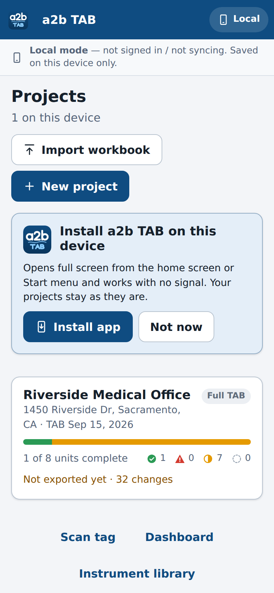

The **Projects** screen offers it for you:

- **Android, or Chrome / Edge on a laptop:** a card **Install a2b TAB on this device** with an **Install app**
  button. Tap it, then **Install** in the browser's dialog.
- **iPhone / iPad:** the card explains the two taps instead (iOS has no install button): **Share** → **Add to Home
  Screen**.

**Not now** / **Got it** hides the card on that device. It also disappears once the app is installed. If you
dismissed it, or the card doesn't show, use the browser menu:

| Device | Browser | Steps |
|---|---|---|
| iPhone / iPad | **Safari** (required on iOS) | Tap **Share** (square with an up arrow) → scroll down → **Add to Home Screen** → **Add**. |
| Android phone / tablet | **Chrome** | Tap **⋮** (top right) → **Install app** (some phones say **Add to Home screen**) → **Install**. |
| Windows / Mac laptop | **Chrome** or **Edge** | Click the install icon at the right end of the address bar, or open the browser menu → **Install a2b TAB** (Edge: **Apps → Install this site as an app**). |

The app shows up as **a2b TAB** (or **TAB**) with its own icon and opens full-screen, with no browser bars.

> **iPhone/iPad:** the home-screen app and Safari keep **separate** data. A project created in the home-screen app
> won't show up if you open the same link in a Safari tab, and the reverse is also true. Pick the home-screen app
> and stick with it.

### Working offline

Once the app has been opened one time with a connection, everything works with no signal: projects, forms, photos,
the workbook export and the PDF reports. It all runs on your device. Roofs and basements are fine.

### The Local-mode banner

Right now every screen shows:

> **Local mode** — not signed in / not syncing. Saved on this device only.

The header also has a **Local** pill. This means:

- **Microsoft sign-in and cloud sync are not live yet.** They're planned. When they arrive, the header will offer
  **Sign in with Microsoft**, and the pill will show **Synced**, **N unsynced** or **Offline**.
- **"Saved on this device only"** means exactly that. Your projects live in the app's storage on this phone,
  tablet or laptop. Another tech's phone can't see them, the office can't see them, and nothing is backed up
  anywhere.
- Every change is still logged, so when sync is turned on later, nothing you entered is lost.

### Backing up: export

Until sync is live, **the exported workbook is your backup**. Export at the end of each site day and save the file
to the project's Dropbox folder (see [Exports](#8-exports)). If a phone is lost, broken or reset, you can bring the
project back from that file with **Import workbook** on the Projects screen. Photos aren't in the workbook, so
also save the **Photos (.zip)** when photos matter.

The app keeps count for you:

- Each project card on the **Projects** screen, and the **Export** tab (**Last export**), show *Last exported Sep 24,
  2026, 3:10 PM (Prelim) · 12 changes since*, or *Not exported yet · 9 changes*. It turns amber when there are
  changes that aren't in an export yet. A "change" is one saved edit (a field, a row, a photo, an issue…).
- When you **leave a project** (the back arrow to the Projects screen) with changes since the last export, the app
  asks **Export before you leave?**: **Go to Export**, **Leave without exporting**, or **Don't remind me again
  today** (for that project, on this device).

The reminder only works inside the app. Closing the app or the browser tab doesn't trigger it.

### Updates

The app updates itself. When a new version is published, it downloads in the background while you work. Then a
bar at the bottom says **Update available. Reload to use the new version; your entries are saved.**

- **Reload** switches to the new version right away. Everything you entered stays.
- **Later** hides the bar. The new version starts the next time you open the app after closing it fully.

It never reloads by itself, so a half-typed reading isn't lost. The app looks for a new version when it opens and
every hour while it's open.

**Check for updates** (bottom of the project list) looks right away: it says *This is the latest version*, or brings
up the *Update available* bar. Above it, **version** shows the build date and code (for example *2026-10-01 ·
85591b8*); two devices showing the same version run the same app.

---

## 2. Projects

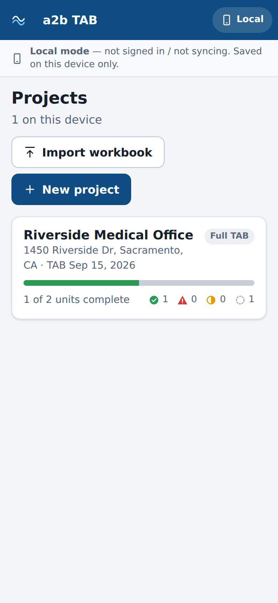

The **Projects** screen lists every project on this device, with its scope, address, TAB date, a progress bar and
counts of green / red / amber / gray units.

### Create a project

1. Tap **+ New project**.
2. Enter the **Project name** (required), **Physical address** and **TAB date**.
3. Pick a **Scope profile** (see below).
4. Tap **Create project**.

To bring in an existing workbook instead, tap **Import workbook** (see [section 9](#9-follow-up-re-importing-an-issued-workbook)).

Inside a project, the tabs are **Info**, **Equipment**, **Issues**, **Attention**, **Photos** and **Export**.

### Scope profiles

| Profile | What's required |
|---|---|
| **Full TAB** | Everything (the default). |
| **Airflow Only** | Identity, design CFM, airflow readings and the instrument. Unit data, motor, drive, RPM, static profile, misc. info and equipment photos are set to N/A for you. |
| **Custom** | You turn sections on or off yourself, per equipment type (Info → **Scope and tolerance**). |

You can change the profile later on **Info → Scope and tolerance → Scope profile**.

With **Custom**, the card lists every equipment type (RTUs, MAUs, ERVs, Fans, Small fans, VAVs, Hoods, Traverses).
Tap a type to open it, then tap a section chip to switch it off (or on again). The type's line shows e.g. *2 of 14
sections off*. A switched-off section shows **N/A (scope)** on every unit of that type.

On any unit, a section switched off by the scope can be switched back on with **⋮ → Include (override scope)**.

### Tolerance and report type

**Info → Scope and tolerance**:

- **Airflow tolerance (± % of design)**: ±5, ±10 (the standard), ±15 or ±20 %. This sets when a reading turns a
  unit red. It's also written to the workbook's Equipment Summary, so the printed "OK / Check" column matches the app.
- **Report**: **Preliminary** or **Final**.

### Project information

**Info → Project information**. Required: project name, physical address, mechanical engineer, mechanical
contractor, TAB date, technician(s), project manager, report date, and **Narrative: system set-up description**.
Optional: architect, electrical engineer, general contractor.

The status card at the top of **Info** lists everything still missing at the project level (project info,
narrative, cover photo, calibration, building pressures, and on a final report the certification signature and date).
Tap an item to jump to it.

### Blueprints used

**Info → Blueprints used**: up to 9 sheets, each with its **Revision date**. Tap **Add sheet** for another.

### Cover photo

**Info → Cover photo**: **Take photo** or **Choose**. It's placed on the workbook's Cover Page at export, cropped
to the photo box (a wide shape, about 1.7 : 1), so frame it wide. If this report has no cover photo, use the **N/A…**
menu next to *No cover photo for this report?*.

### Instruments and calibration

**Info → Instruments (Calibration sheet)**. New projects start with the **7 a2b instruments** from the template:

| Instrument | Make / model |
|---|---|
| Balometer | Evergreen Telemetry Three Pounder |
| Digital Micromanometer | Evergreen Telemetry S-PVF-1 |
| Laser Tachometer | Extech 461920 |
| Voltage/Amperage Multimeter | Fluke 902FC |
| Digital Temperature Tester | Fluke 52 Series II |
| Humidity Tester | Fluke 971 |
| Hydronic Pressure Measurement | Evergreen Telemetry S-DP-250 |

Edit any field, **Remove** what you didn't use, or **Add instrument** (8 slots, the Calibration sheet's limit).
When a **Calibration date** is more than 12 months before the TAB date, you'll see *More than 12 months before the
TAB date*, and the item appears on the **Attention** tab. Update the date or swap the instrument.

On unit, hood and traverse pages you pick the *kind* of instrument (Flow Hood, Velocity Grid, Pitot Traverse…). If no
calibration row covers that kind, you get an amber note.

### The dashboard (for PMs)

**Projects → Dashboard** lists every project on the device (all the team's projects when signed in) in one table: its
stage (*No units yet*, *In progress*, *Ready to issue*: every unit complete and reviewed with no open unit issue or
conflict, *Issued*), units complete and reviewed with a count per type, how many items the Attention tab lists, open
issues, the last export and how many changes came after it, and the last activity (plus changes not synced yet, when
signed in). Search by name or address, show *Not issued* / *Ready to issue* / … and sort by last activity, name, TAB
date, least complete or most to check; the app remembers your choice. Tap a project to open it, or its *To check*
number to go straight to its Attention tab. On a phone each project is a card.

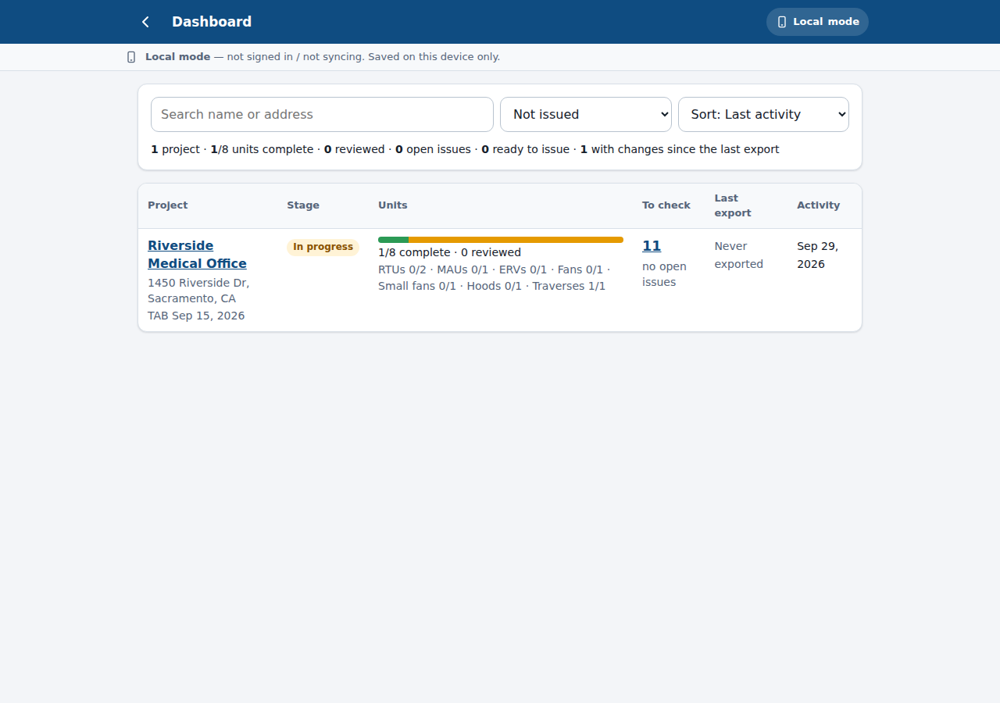

### The instrument library

Your meters, entered once and reused on every project. Open it from the bottom of the **Projects** screen
(**Library**). The same page holds the unit configuration, valve and pump libraries.

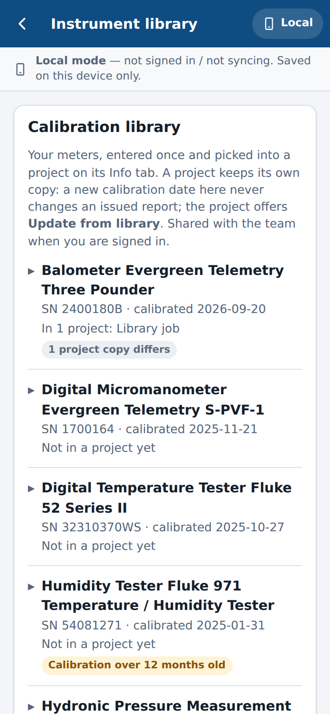

- **Add instrument**, or on an empty library **Add the template's 7 a2b instruments**. Tap an instrument to open it and
  edit its type, manufacturer, model, serial, calibration date and notes. A calibration more than 12 months old shows
  **Calibration over 12 months old**.
- In a project: **Info → Instruments → Choose from the library… → Add from library** puts a copy into the next of the
  8 calibration slots. A project row you typed yourself can go the other way with **Save to library**.
- **The project keeps its own copy.** When a meter is recalibrated, change its date in the library once. Projects are
  **not** changed by that (an issued report must stay as it was issued). Instead, each project that has the meter
  shows *The library has calibration …* with **Update from library**; tap it on the projects that should get the new
  date. The library says how many project copies differ.
- Removing a meter from the library doesn't remove it from any project.
- When you're signed in, the library is shared with the whole team. In Local mode it's on this device.

### The unit configuration library

Also on the **Library** page: one entry per product line (Carrier WeatherMaster 48GE, Munters DryCool HCUc, CaptiveAire
direct-fired make-up air …) with

- the **order of the components in the supply air**, inlet to discharge (dampers, filter, wheel, cooling coil, reheat
  coil, desiccant wheel, burner, fan, heat, final filter), each optional component marked;
- **how that order is known**: *Stated* by the manufacturer, *Inferred* from its documents, or *Not confirmed*, with the
  evidence (the sentence or figure and the document it is in);
- the line's **documents**: manuals, product data, submittals and drawings, with their form number and a link;
- **model patterns** (`48GE*`, `A?-D*`; spaces and dashes ignored) and other names of the make, so units find their
  entry.

On an empty library, **Add the researched product lines** loads the October 2026 research (Carrier, York, Lennox, Trane,
Addison, Munters, CaptiveAire, Seasons-4); check the *Inferred* and *Not confirmed* orders against the drawings.

A unit whose make and model match an entry shows it at the top of its **Static pressure profile** section: the order,
the documents, and in amber where the template draws the components in a different order (for example a rooftop unit
whose heat is after the fan, which the template draws before it) or has no place for one (a reheat coil, a desiccant
wheel). Until the template follows the unit's order, note on the report which tap each reading was taken at. A unit
with no match links to the library to add one.

The section also draws the unit: its cabinet in the library's order (the template's when there is no entry), with a
**tap** at each place a reading is taken. A tap with a reading shows it in red; an empty tap is dashed, so you can see
where the next reading goes, and tapping it moves to its field. The pressure change between readings is under the
drawing ("rise" across the fan). A reading the template names after a component that is past the fan on this unit (an
RTU's heat) is drawn at the **fan inlet**, and its field says so: "Leaving Heat (at the fan inlet on this unit)". A
unit marked **Unit has filters? No** has no filter section. The graphics appendix draws the same diagram for each
profile, with the library entry the order comes from.

### Building pressures

**Info → Building pressures (Building Balance)**:

- **Building vs Outdoors**: ΔP (required) and remarks.
- **Kitchen vs Dining**: ΔP, required only when the project has a hood. With no hoods it's N/A for you.
- **Spare pair (optional)**: your own test space / reference space, ΔP and remarks.
- Notes (up to 3 lines).

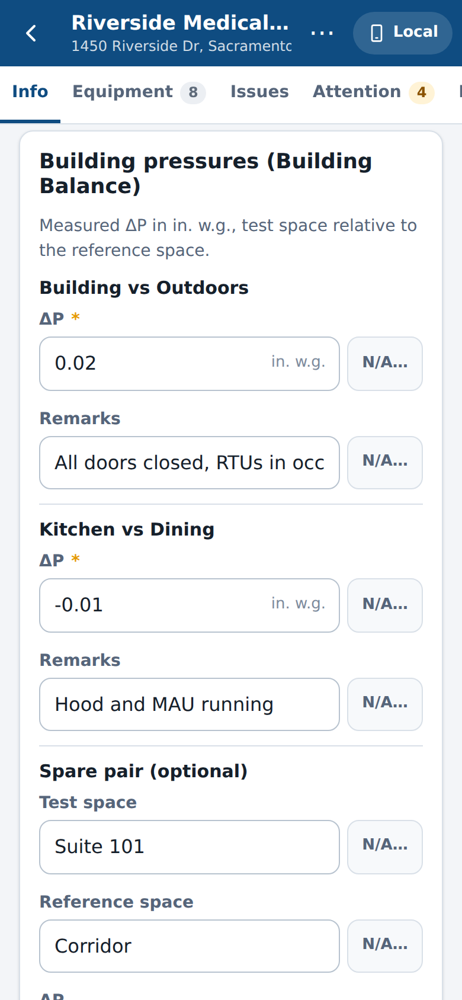

### Other outside air

**Info → Other outside air (Building Balance)**: outside air you didn't measure on a unit page, such as a transfer
grille or a relief opening. Tap **Add OA row** for each (up to 20). Each row has **Unit / source**, **Design** and
**Actual** CFM (either can be marked N/A, Not Avail. or Not Acc.). The app shows the % of design and the rows' total.
They go into the spare outside-air rows on the workbook's Building Balance sheet, so they count in the building's OA
totals. The trash button removes a row (the rows below move up).

### Building balance

**Info → Building balance** lists every unit that feeds the Building Balance: RTU OA, MAUs and ERV supply on the
outside-air side; fans, small fans 1–30 and ERV exhaust on the exhaust side, with each one's design and actual CFM
(*sched.* = the schedule's design before readings exist). Below it, the outside air, exhaust and net totals: design,
actual and, when the schedule's air balance was imported, the engineer's totals with the difference in amber (a unit
missing, or a design CFM that differs from the engineer's table).

**Incl.** (in balance): switch a unit off when the ventilation calculation leaves it out, e.g. an isolated room with its own
intake louver paired with its fan (*Note 1: EF-22 and EF-23 excluded*). It is greyed, marked **Excl.** and left out of
every total (and the graphics summary); it is still tested and reported on its own page. Say why in the line that
appears (*isolated rooms with dedicated intake louvers, ventilation calc Note 1*). Units the imported air balance
table marks with a note start switched off. In the workbook an excluded unit's row is greyed, its % shows **Excl.**,
the sheet's totals leave it out (an **Excl.** typed in column P / Q next to a row in Excel does the same, and a
re-import reads it back), and the reason is the line under the notes. A re-issued rev 05 / 06 workbook still counts
excluded units.

The air balance totals and the exclusions travel with the exported workbook (as a file property), so they come back
when the workbook is imported on another device.

### Certification

**Info → Certification** fills the workbook's Certification sheet:

- **NEBB certified professional**, **Certification number** and **Expiration date**: new projects start with the
  ones on the **Certification profile** (below; until someone sets it up, the template's: Isaac Rochester, 24053,
  December 31, 2026). Change them if someone else certifies the report. An
  expiration date before the report date gets an amber note.
- **Signature (signed by)** and **Date**: required on a **final** report. On a preliminary report they're N/A for you
  (the workbook shows *N/A* on those lines) unless you fill them in. Change the report type under **Scope and
  tolerance → Report**.
- The **stamp** and **signature image** come from the Certification profile: every export places them on the
  Certification sheet (the card says whether the profile has them).

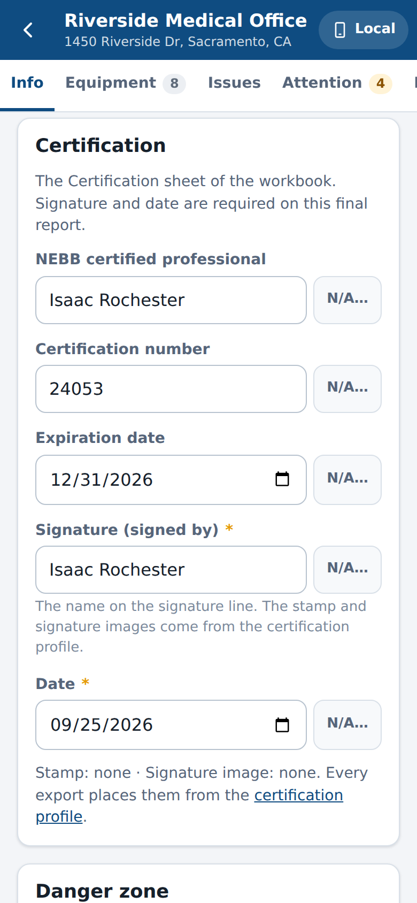

#### Certification profile: stamp and signature

**Projects → Certification (stamp & signature)**. Set up once and shared with the whole team when signed in:

- The certified professional's name, number and expiration date that **new projects** start with.
- **Stamp:** **Choose picture**, a scan or photo of the stamp cropped close (a PNG with a transparent background prints
  best). Every export fits it into the stamp box, centred.
- **Signature:** **Draw signature** with a finger or stylus (then **Use this signature**), or **Choose picture** for a
  scan. Every export puts it on the signature line, over the signer's name.
- **Remove** takes an image off; later exports leave that spot empty (an exported or issued file keeps what it had).
  Anyone on the team can export with them, and the History shows who exported what.

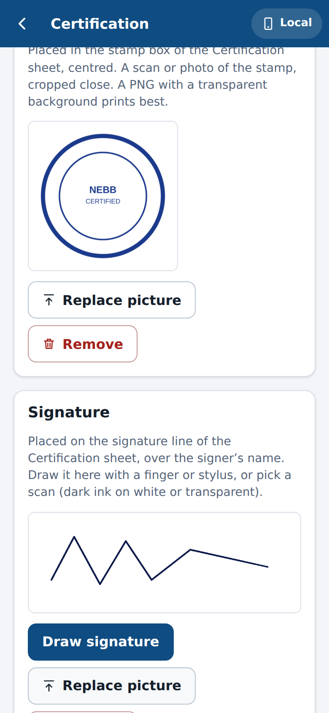

### Delete a project

Open the project, then tap **⋯** at the top right → **Delete project…** (also at the bottom of **Info → Danger zone**).
Export the workbook first if you may need it: a delete cannot be undone.

- **Local mode** (or a project kept on this device only): it is removed from this device.
- **Signed in with cloud sync:** it is removed **for everyone**: from every device and from the cloud, with its photos
  and history. The confirmation says which one it is.

---

## 3. Equipment

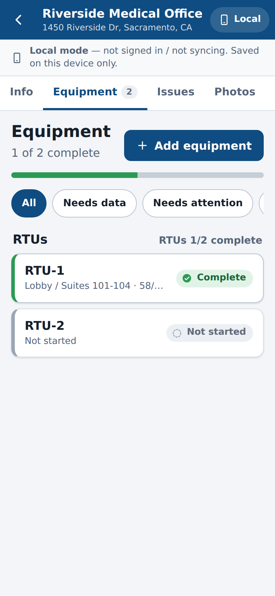

### Types and capacities

The workbook has a fixed number of slots for each type, and the app won't let you add past that number.

| Type (as shown in the app) | Designation | Capacity |
|---|---|---|
| RTUs (RTU / AHU / DOAS) | RTU- | 40 |
| MAUs (MAU / supply fan) | MAU- | 10 |
| ERVs | ERV- | 10 |
| Fans (EF, TF, KEF) | EF- | 40 |
| Small fans (direct drive under 1/6 hp) | EF-S | 40 (**Building Balance lists only 1–30**) |
| VAVs | VAV- | 80 |
| Hoods | H- | 20 |
| Traverses | T- | 48 |

Small fans 31–40 still go into the Small Fans sheet, but the Building Balance exhaust total leaves them out. The app
warns you when you go past 30.

### Add equipment

**Equipment → + Add equipment** → pick the type (each shows how many slots are used, e.g. *3 / 40 used*) → check or
change the **Designation** → **New** or **Existing** → **Add RTU-3**, or **Add & add another** to keep going.

**New / Existing** decides where the unit's issues go: New → *Summary - New*, Existing → *Summary - (E)*. You can
change it later on the unit page.

### Import a schedule

For long equipment lists, bring in the mechanical schedule instead of typing it: **Equipment → Import schedule**,
or **Import** next to a type heading (that picks the type for you).

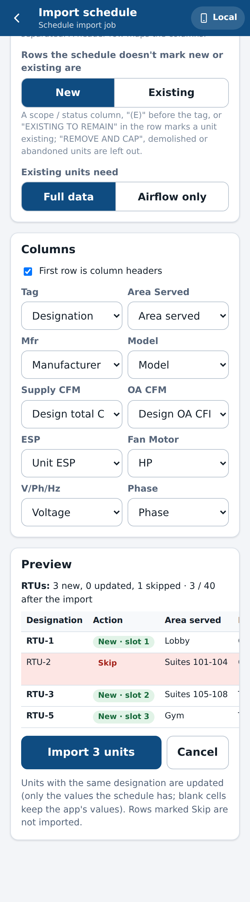

1. **Source**: pick one of
   - **Paste rows**: copy the schedule rows **with the header row** in Excel (or from a PDF table pasted into Excel)
     and paste them.
   - **File (CSV, Excel, PDF, photo)**: a `.csv`, `.xlsx` or `.xlsm` file, a **PDF** of the drawings or a
     submittal, or a **photo** of a schedule (JPEG / PNG). The app finds each schedule by its grid lines and lists
     them all under **Tables** by page and title (*p. 1 · FAN SCHEDULE*). Tables that aren't schedules (revision
     blocks, curb details) are left out.
     - PDFs with text (made from CAD / Revit / Word) are read directly.
     - **Drawings without text** (text plotted as lines, a scanned set) and **photos** are read by **text
       recognition** on the device: the table says *(text recognition)*, a note asks you to check the values, and
       the values it was unsure of are **highlighted** in the preview. A 36 × 48 sheet with six schedules takes
       about a minute on a laptop, longer on a phone; progress shows while it reads. It works offline once the app
       has downloaded text recognition (it does that by itself in the background, about 7 MB, the first time the app
       is open with a connection).
     - Check model numbers in particular: drawing fonts make 1 / I, 0 / O and 5 / S easy to confuse.

     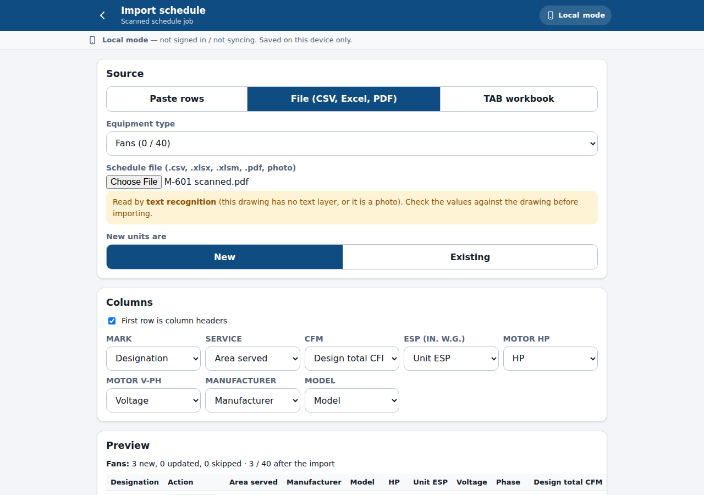

   - **TAB workbook**: an existing a2b workbook. Only its Equipment Data Entry section is read.
2. **Tables** (a file with more than one table): **every ticked table is imported in one go.**
   - A unit schedule is ticked when its title names a type the app has (*ROOFTOP*, *MAKE-UP AIR*, *FAN*, *PUMP*…),
     with that type picked; change the type, or tick / untick any table. Schedules for units the app has no type for
     (*FAN COIL*, *CONDENSING UNIT*) start unticked.
   - The building **air balance** (*AIR BALANCE*, *VENTILATION CALCULATION*: unit / OA CFM / unit / exhaust CFM, with
     totals) is marked **Air balance** and checked against the units (step 6).
   - Space-by-space ventilation tables (room / zone / occupancy / area) are marked **Space ventilation** and left
     out: TAB doesn't need them.
   - Tables without unit tags (general notes, gas pipe sizing) are folded away under **other tables**.

   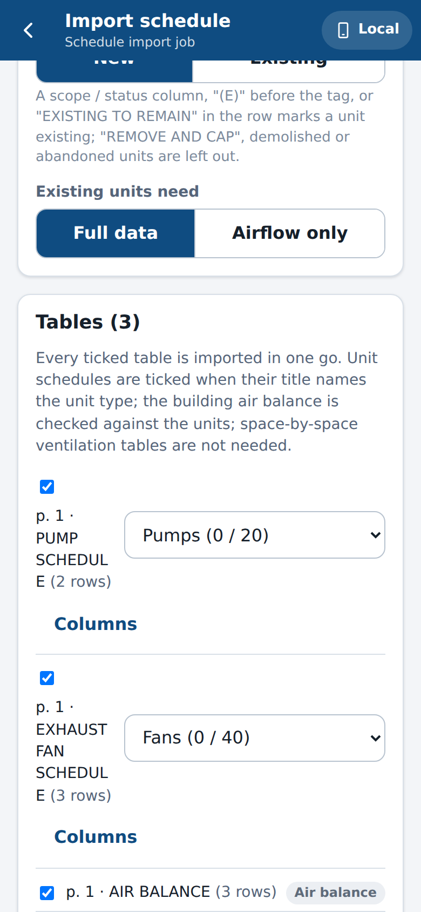
3. **New or existing, and removed units.** The schedule decides where it says so:
   - a **scope / status column** (*PROJECT SCOPE*, *NEW / EXISTING*, *STATUS*): *NEW* → New; *EXISTING*, *E*,
     *EXISTING TO REMAIN*, *RELOCATED* → Existing; *REMOVE*, *REMOVE AND CAP*, *DEMO*, *EXISTING TO BE REMOVED* →
     removed;
   - **(E)** or **(N)** before the tag (*(E) RTU-5*);
   - *EXISTING TO REMAIN* or *REMOVE AND CAP* anywhere in the row (a remarks column, or across the data cells);
   - the **table's title or a note in it**: every unit in an *EXISTING FAN SCHEDULE*, or a table noting *ALL
     EQUIPMENT IS EXISTING TO REMAIN*, is existing, unless its row says otherwise (*DEMO EXISTING* is removed).

   **Shell & TI**: on a TI set for a new building, equipment installed under the shell (rooftop units…) is shown as
   existing, but it's new to the building and gets full TAB. Set **Units the schedule marks existing are: New (built
   under the shell)**: they come in as New with full data (the preview shows *Existing → New*), units only in the air
   balance too. Removed units are still left out. Single units can always be switched on the unit page.

   **Removed units are left out** (Skip, *Removed (REMOVE AND CAP): not in the scope*): they aren't in the report.
   Existing units are imported and reported (with an **Existing** chip in the preview). For rows the schedule
   doesn't mark, pick **Rows the schedule doesn't mark new or existing are: New / Existing**.

   **Existing units need: Full data / Airflow only**. With **Airflow only** (per the proposal), each existing unit
   the import creates gets its unit data, motor, drive, misc., RPM and static sections marked **N/A**, so only its
   design data, airflow, photos and remarks are asked for. You can change this on any unit later (below).
4. **Columns** (of the table picked with **Columns**): the app matches headers such as *Tag*, *Mark*, *Mfr*,
   *Supply CFM*, *OA CFM*, *E.S.P.*, *V/Ph/Hz*, *Project scope*. Check each dropdown, and change it or set it to
   *— ignore —*. Untick **First row is column headers** if there's no header row.

   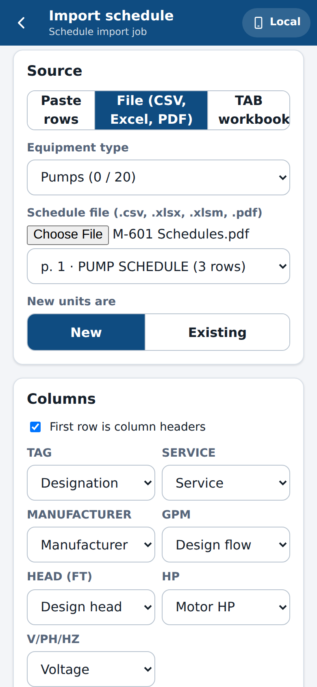
5. **Preview**, one per unit type (tables of the same type are combined): each row shows **New · slot N**,
   **Update** (that designation already exists), or **Skip** (with the reason: removed, bad number, no designation,
   repeated designation, over capacity). Values like `1,200 CFM`, `1-1/2` and `460/3/60` are understood.
6. **Air balance** (when a ticked table is one): its design OA, exhaust and net, and each unit it lists:
   - **Matches**, or **Unit: … Confirm (not changed)** when the unit's schedule says
     something else (the unit keeps its schedule value; check it on site or with the engineer);
   - **Fill blank unit design CFMs from the table** (a unit whose schedule has no CFM);
   - **Add the units the schedules don't have (as Existing)**: units the air balance lists but no schedule does
     (usually existing units that stay), with the table's CFM as their design OA / exhaust. An OA source that isn't
     a unit type goes to an **Other outside air** row;
   - if its totals leave out some rows with a note mark (*(1) EF-22 & EF-23 serve mechanical spaces, not part of the
     air balance*), the app says so and compares the same way.

   Its totals are kept on the project: **Info → Building balance** (below).

   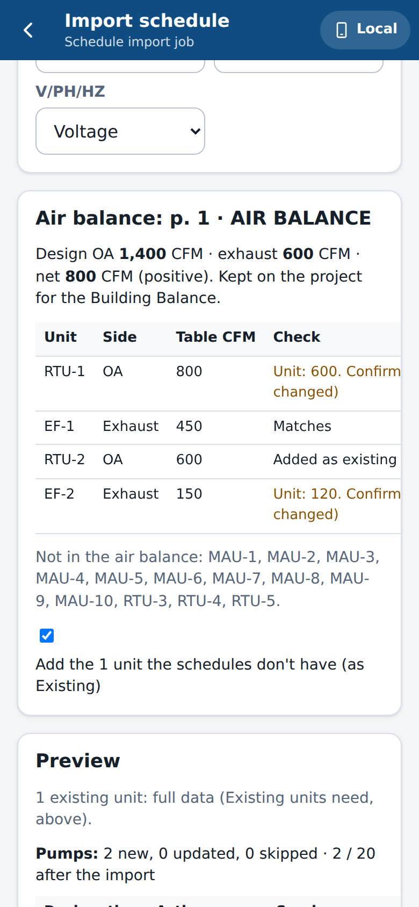
7. Tap **Import N units** (**+ air balance** when there is one).

An RTU's scheduled **design OA** also goes on its **outside-air row** (a new *OA* row, or the design of its only
one if blank), so the workbook's **Building Balance** shows the design OA right after the import. The air balance's
fill does the same. MAU and fan design lines on Building Balance come from their outlet / hood rows, so they fill
in as those rows are entered.

Updating an existing unit only fills in the values the schedule has. Blank schedule cells never erase what's in the
app. Skipped rows aren't imported at all, so fix them and import again.

**Airflow only on a unit**: on an existing unit's page, under **New / Existing**, **Airflow only** marks its unit,
motor, drive, misc., RPM and static sections N/A in one tap (tap again for full data). Single sections can still be
changed with their own N/A menus.

### Duplicate a unit

At the bottom of a unit page: **Duplicate → Duplicate RTU-3**. The app suggests the next designation and shows
which workbook slot it will use. It copies the schedule and set-up data (unit type, drive, motor nameplate,
filters, instrument, method…) and, if you leave **Copy outlet / filter rows (without readings)** ticked, the outlet
rows without their readings. It never copies the serial number, readings, remarks or photos. Tap **Create RTU-4**.

### Status colors

Every unit card, type heading and project shows a status. Each one has its own icon shape as well as its color:

| Color | Label | Meaning |
|---|---|---|
| Gray (dashed circle) | **Not started** | Nothing entered yet. |
| Amber (half circle) | **In progress** | Some required items are still blank. **Show missing** on the unit lists them. |
| Green (check) | **Complete** | Every required item is filled in or marked N/A. |
| Red (triangle) | **Issue / tolerance** | The unit has an **open issue**, or a reading is **outside the tolerance** (e.g. ±10 % of design). The card says which: *1 open issue · 2 out of tolerance*. |
| Blue (square with a double check) | **Reviewed** | Complete, and signed off by a reviewer (see [section 10](#10-review-issuing-the-report-and-history)). |

A unit can be red even when all its data is filled in. Close the issue or re-check the reading to clear it.

The filter chips on the Equipment tab narrow the list:

| Chip | Shows |
|---|---|
| **All** | Every unit |
| **Needs data** | Units with required items still blank (and units not started) |
| **Issue / tolerance** | Red units only |
| **Complete** | Green units (reviewed or not) |
| **To review** | Complete units that aren't reviewed yet |
| **Reviewed** | Blue units |

Each type heading counts them too, e.g. *RTUs 5/8 complete, 3 reviewed*.

### The Attention tab

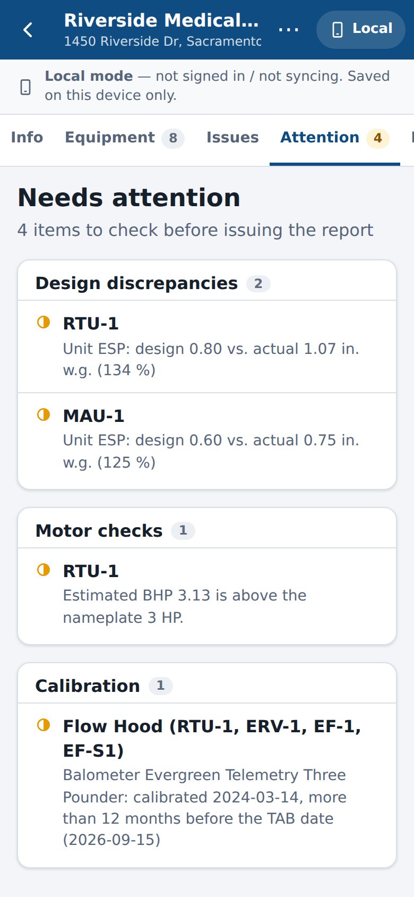

The **Attention** tab (with a count badge; also a **Needs attention** card at the top of Equipment) is your list of
things to check **before issuing the report**. It's wider than the red units: it also lists amber warnings. Everything on it is grouped, and each item opens the unit at the right section:

- readings out of tolerance
- open issues
- design discrepancies: the schedule design CFM doesn't match the sum of the outlet design CFMs, or the actual
  unit ESP is outside the tolerance of the design ESP
- motor checks: amps above corrected FLA × SF, nameplate HP different from the scheduled HP
- missing required photos (only on units you've started)
- calibration: an instrument used with no calibration row, or calibrated more than 12 months before the TAB date
- capacity: a type that's full, small fans past slot 30

Amber items are **warnings**. They don't block anything or change a unit's color.

---

### Grid entry on a tablet or laptop

Outlet, inlet and filter rows can be entered as a **spreadsheet grid**: one line per row, one column per reading, with
the CFM (initial / final) and % of design at the end. Tap **Grid** on a table's heading to switch (**Cards** switches
back); the app remembers the choice on that device, and wide screens start in the grid. In the grid, **Enter** or
**↓** moves to the same column one row down (**Shift+Enter** / **↑** one row up), so a column of velocities goes in
without touching the screen between readings. N/A marks and **Delete / Duplicate row** are in each row's **⋯** menu.

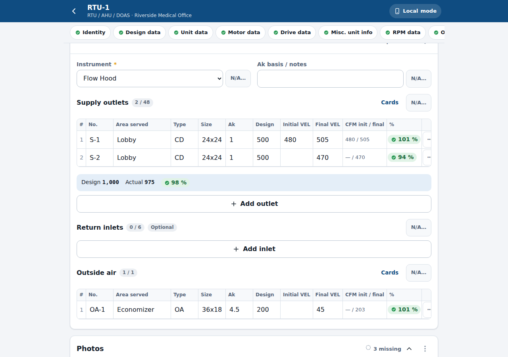

### QR tags on the units

**Equipment tab → QR tags** makes a PDF of 2 in. labels, one per unit (untick the ones you don't need): a QR code, the
designation, the unit type and the project. Print at 100% on plain paper and cut them out, or on 2 in. square label
sheets (12 per Letter page), and stick each on its unit.

Scanning a tag opens that unit's page:
- **In the app:** Projects → **Scan tag** and point the camera at the tag (works on iPhone and Android).
- **With the phone's Camera app:** point it at the tag and tap the link; it opens in the browser.

The project has to be on that device (signed in: synced; local mode: the device the project was made or imported on);
otherwise the page says so.

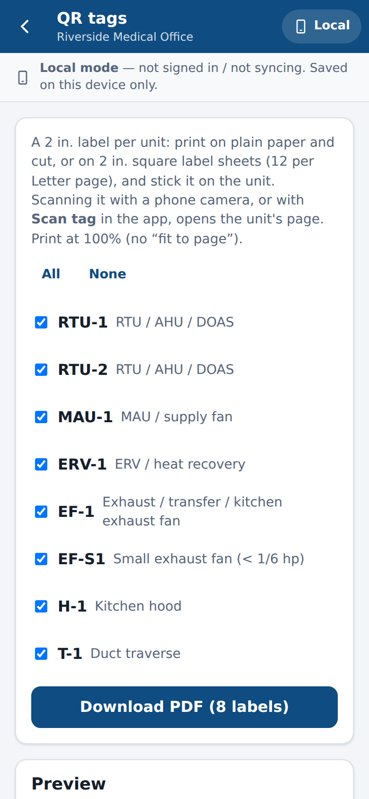

## 4. Filling in each unit type

### How every unit page works

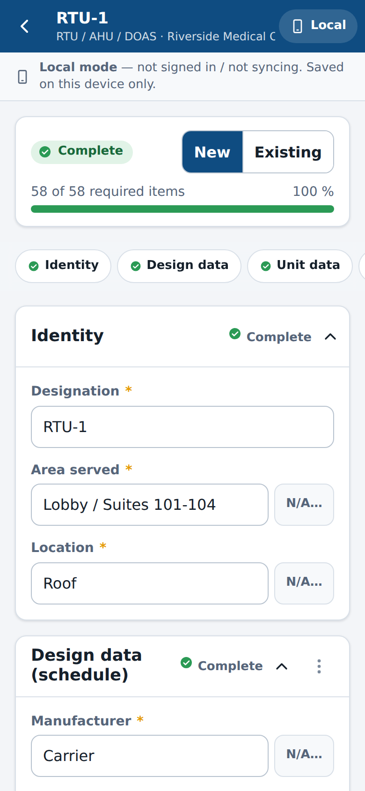

- **Top card**: the status, **New / Existing**, *N of M required items*, and any red or amber callouts
  (tolerance, open issues, discrepancies). **Show missing (N)** lists every blank required item as a link.
- **Section bar**: chips (**Identity**, **Design data**, **Unit data**…) with a status icon each. Tap one to jump
  to that section.
- **Sections** collapse and expand. Each has its own status and a **⋮** menu (section N/A).
- **Auto-save**: every field saves a moment after you stop typing and when you leave it. There's no Save button.
- A **\*** marks a required field.
- Number fields open the number keypad.
- **Remarks** print on the unit's page. **Field notes (not in the report)**, under them, are for working math, sizes
  and readings to re-check: they stay in the app and are never exported. **Move remarks to field notes** moves the
  whole remark there in one tap (the page also says when the remarks look like working math).

### Airflow rows (outlets, inlets, registers)

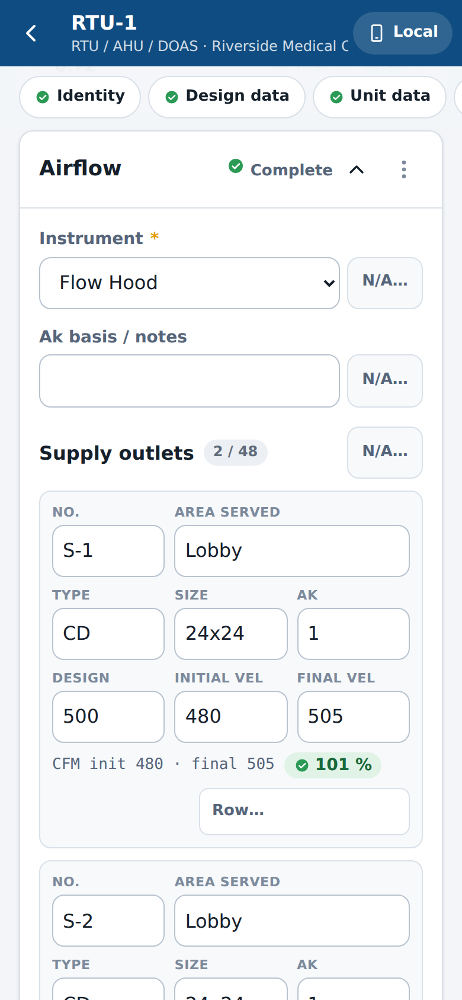

Each row has **No.**, **Area served**, **Type**, **Size**, **Ak**, **Design**, **Initial VEL** and **Final VEL**.
Under the row you see the calculated **CFM** (VEL × Ak) and **% of design**, in green or red. Once the row has a
design CFM and an Ak, it also shows the **Design VEL** (design CFM ÷ Ak, the workbook's Design VEL column): the
velocity to look for before the first reading. The VEL boxes show it as a hint (*target 625*).

- **Add outlet** (or *Add inlet*) copies area, type, size and Ak from the previous row, and numbers it S-1 → S-2.
- **Row…** menu: mark a column N/A / Not Avail. / Not Acc., **Duplicate row**, **Delete row**.
- A row counts as done with a reading in **either** Initial or Final, which fits prelim reports.

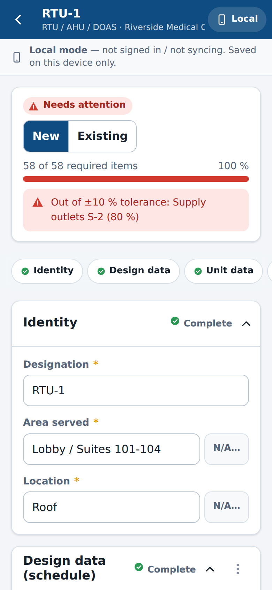

### RTU / AHU / DOAS

Sections: Identity · Design data (schedule) · Unit data · Motor data · Drive data · Misc. unit info · RPM data · OA
damper · Static pressure profile · Airflow · Photos · Remarks.

- **Unit type** (RTU or DOAS) sets which static-pressure components exist. RTU has no wheel, so *Leaving component
  2* shows *Auto N/A · not on this unit type*.
- **Drive data**: **Motor sheave** with **Motor bore (shaft)** next to it, then **Fan pulley** with **Fan bore
  (shaft)** (e.g. *2VP60* and *1-3/8*). A value entered earlier in the old *Sheave bore M/F* box (*motor / fan*) is
  split into the two bores the first time the unit is opened. The workbook shows each bore beside its sheave /
  pulley (a re-issued rev 05 / 06 workbook: both in its *Shv Bore M/F* box as *motor / fan*).
- **Drive type**: when it's Direct or ECM, the sheave / pulley / bore / belt / C to C fields are N/A for you.
- **RPM data**: initial and final are both required (the same value when nothing was changed). On a Direct or ECM
  drive the fan turns at motor speed: enter the **fan RPM** (initial and final); the motor RPM row is N/A.
- **VFD on the unit?**: when the answer is No, the VSD frequency fields are N/A.
- **Unit has filters?**: when the answer is No, the filter fields and filter static are N/A.
- **Design OA CFM** of 0 or blank makes the OA damper, the OA row and the OA damper photo N/A.
- **Phase** 1-phase makes volts / amps legs 2 and 3 N/A.
- **Airflow**: up to 48 supply outlets. Return inlets are optional. The OA row is required when there's design OA.

**Static pressure profile and motor panels** (RTUs, MAUs, ERVs, fans):

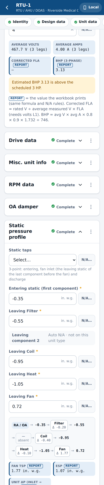

- Enter the entering static at the first component and the leaving static after each component. The strip shows
  each component's Δ, then **Fan TSP**, **ESP** (unit ESP actual) and **Unit ΔP (inlet → fan)**.
- **Static taps: 3-point** (the usual packaged RTU: entering / return, fan inlet, discharge). Enter the entering
  static, the **fan inlet** as the leaving static of the last component before the fan (Heat on an RTU, Burner on an
  MAU) and the discharge as the fan's leaving static. The other leaving statics become N/A automatically and are left
  blank in the workbook, so its TSP, ESP and unit ΔP still calculate. The drop between entering and fan inlet then
  shows under that last component in the workbook; the graphics appendix shows it as one drop across all the
  components in between. A workbook with only those three readings comes back as 3-point.
- Motor: **Average volts**, **Average amps**, **Corrected FLA** (rated V ÷ average measured V × FLA) and
  **Estimated BHP** = HP × average amps ÷ FLA: the nameplate HP when entered (else the scheduled HP), the corrected
  FLA when it can be calculated (else the nameplate FLA). A motor drawing its FLA estimates its nameplate HP. (Before
  template revision 07: V × A × 0.8 × 0.9 (× 1.732) ÷ 746, which put a motor at its FLA above its nameplate HP.)
- Values tagged **REPORT** are exactly what the workbook will print.
- **Amber warnings** (not errors, and they never change the color):
  - a measured amps leg above corrected FLA × service factor (the same check as a BHP above the HP, since the BHP is
    HP × amps ÷ FLA)
  - *Motor nameplate … HP vs. scheduled … HP* when the **Motor HP (nameplate)** you read off the motor (under
    *Motor data*) differs from the scheduled HP under *Design data*. The workbook has it under the measured
    amperage, and the estimated BHP uses it.
  - *Unit ESP: design … vs. actual … Outside ±10 %*

### MAU / supply fan

Same as RTU, but there's no OA damper and no OA / return rows. The **Supply airflow method** section has
**Method used**:

| Method | What you enter | What the app works out |
|---|---|---|
| **Outlets** | Instrument and outlet rows (up to 28: 16 on page 1, 12 on page 2) | CFM, % per row, total |
| **PSP** (perforated supply plenum) | Length, width (6–24 in.), number of blanks, up to 20 **initial** (optional) and 20 **final** velocity readings | K-factor, average velocity and PSP CFM of each, CFM / ft |
| **Filter Grid** | Filter size, **initial** and **final** velocity for each filter (up to 11) | CFM (velocity × free area × 1.35) of each, totals |
| **Profile Pressure** | Housing size (1–5), burner profile pressure (0.15–0.65 in. w.g.) | CFM from the manufacturer's curve |
| **Intake** | One row per intake screen: size, Ak, velocity against the screen (initial / final) | CFM per screen (VEL × Ak), total |

**Intake screens** can also be read as a **check** next to another method: fill the rows and the totals line shows
*Intake check* with its % of the actual. The workbook lists up to 4 screens on the MAU's second page (a re-issued
rev 05 / 06 workbook has no intake cells: the Intake method and the screens stay in the app, and the export says so).

The method total uses the **final** readings, or the initial ones while there are no final ones yet.

Only the chosen method's inputs are required. The others become N/A. If you switch methods, your earlier entries are
kept in the app and come back when you switch back, but only the chosen method is exported. **Method total** is
checked against design (or against **Design CFM override** if you fill it in).

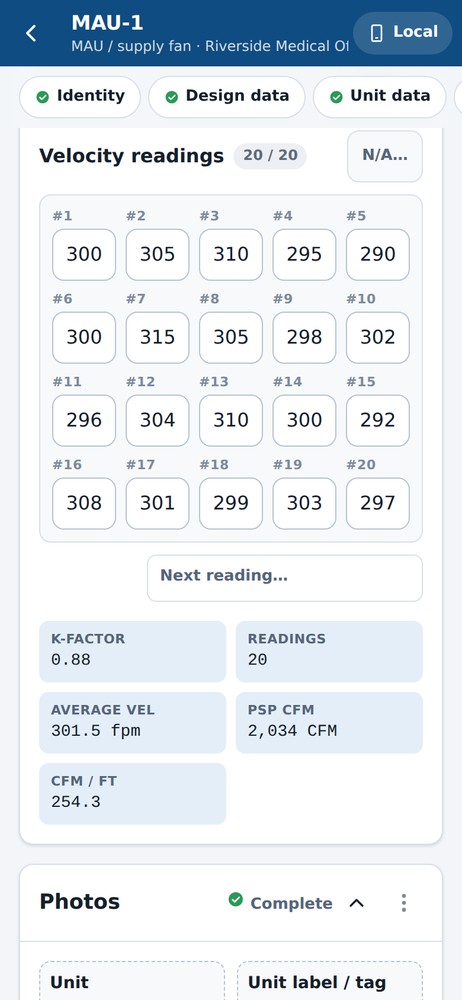

### ERV

Design supply / exhaust CFM and ΔP. **Primary (supply) airflow** with its supply instrument and outlets (up to 24),
**Secondary (exhaust) airflow** with its exhaust instrument and inlets (up to 24), and **Pressure drops (actual)**.
No OA damper. Static profile: Filter, Core, Fan.

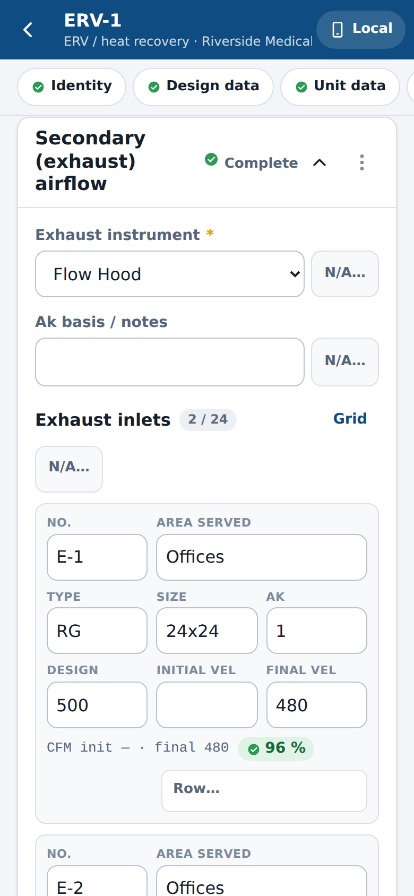

### Fans (EF, TF, KEF)

Like an RTU without OA. The static profile is just fan inlet (entering) and fan discharge (leaving). Airflow is
**Registers / grilles** (up to 55 rows; the last row of page 1 is the *measured at hood* line).

**Measured at the hood.** A kitchen exhaust fan read at its hood(s): set **Airflow measured at** to **Hood**. The
fan's grille table and instrument become N/A, and its airflow is the total of every hood whose *Associated exhaust
fan* names it (a panel lists the hoods, their CFM and the total vs. the fan's design). The Building Balance uses
that total. The workbook (revision 07) has a *Measured at hood* line under the fan's grilles: the hoods and their
design / initial / final CFM, in the fan's totals. (Re-issued onto a rev 05 / 06 workbook, each hood is one row of the
fan's grilles instead: "Hood H-1 (measured at hood)", Ak 1, VEL = the hood CFM.) A re-import turns either back into
the hood link.

Read the fan itself instead (a raw opening, no filters at the hood)? Set **Airflow measured at** to **Grilles** and
enter the reading in its grille table. Grille readings left on a fan measured at the hood are not exported: the fan
page says so in red and the export lists a warning.

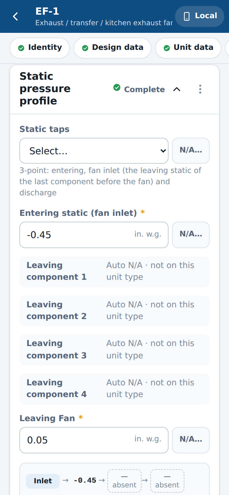

### Small fans

A short page (NEBB 5.3.6). Required: identity, manufacturer, model, **serial number**, **measured amps**, design CFM,
the instrument and at least one outlet row (up to 6), plus the **Unit / tag** photo. HP, voltage, phase, ESP, RPM
and speed settings are optional.

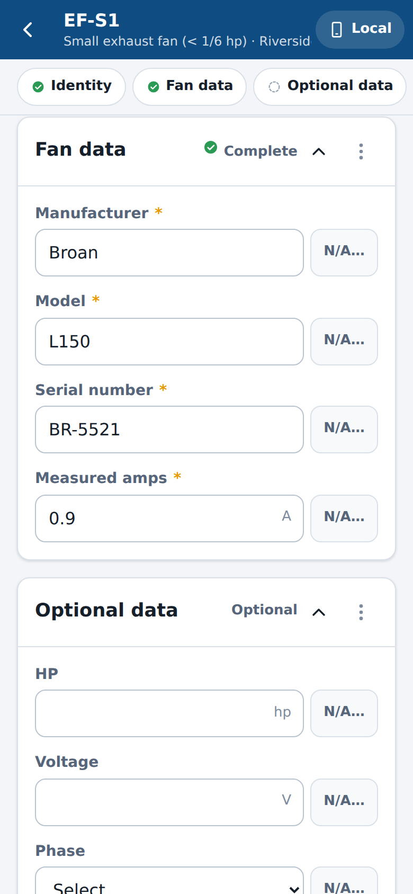

### VAVs

Design data (manufacturer, model, inlet size, terminal type, design max / min CFM, DDC address, plus heating and
fan CFM when scheduled), **Unit data** (serial, calibration factor, **DDC max / min**, e.g. "600 / 150"),
**Performance (actual)** and outlet rows (up to 6). Actual max comes from the outlet readings. Actual fan CFM is
N/A unless the terminal is fan-powered. Actual heating CFM is N/A unless heating CFM is scheduled.

### Hoods

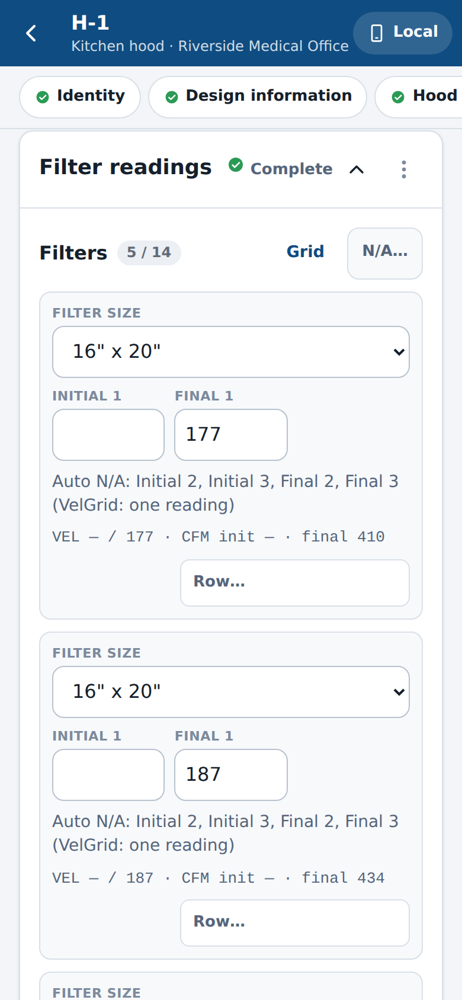

- **Design information**: hood manufacturer, design CFM, hood length, associated exhaust fan.
- **Hood data**: model, serial, hood type, filter manufacturer, **Filter type**, instrument.
- **Filter type** sets the free area, the K-factor, and how many readings each filter needs:
  - **VelGrid** types (Baffle, Captrate, Supply Filter): **1 reading** per filter. Readings 2 and 3 show *Auto N/A*.
  - **Airfoil** types (Condensate Baffle, HVC / Slot): **3 readings** per filter. The workbook averages them.
- **Filter size** only offers sizes that exist for the chosen filter type. **No Filter** makes that row N/A.
- Up to 14 filters. The app shows VEL and CFM per filter, the **Hood total**, % of design and CFM per ft.
- **Associated exhaust fan** suggests the project's fans; a tag that matches no fan gets a warning. That link feeds a
  fan *measured at hood* (see Fans).

### Traverses

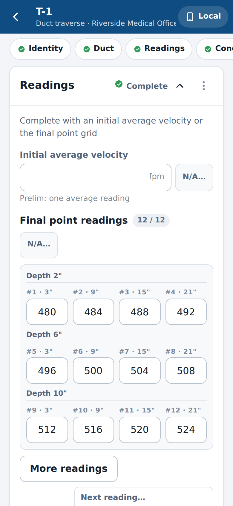

- **Identity**: point (T-#), area served, design CFM.
- **Duct**: **Duct shape** (Rectangular / Round / Flat Oval), **Width / diameter**, **Height** (N/A for round),
  **Liner thickness** (optional). The app works out the size, Ak, number of points and insertion depths.
- **Flat oval** (NEBB 6.3.3h): width = the major axis, height = the minor axis. The flat part, (W − H) × H, is read
  like a rectangle; the two round ends as one round duct of diameter H on the horizontal axis only (6 / 8 / 10 points,
  half at each end). Enter the rectangle readings first (row by row), then the end points (left end, then right end;
  the grid labels them *L end* / *R end*). The CFM is each part's average × its area, added (the readings are never
  averaged together); Final VEL is that CFM ÷ the whole Ak.
- **Readings**: either an **Initial average velocity** (one number, fine for a prelim) or the **Final point
  readings**, laid out in the calculated grid with each depth and position labeled.
  - **Quick entry**: type a reading, press **Enter** or **Next** on the keypad, and it moves to the next point.
  - **More readings** adds another row of points. **Next reading…** marks the next point N/A / Not Avail. / Not Acc.
  - You get a warning if you enter fewer readings than the calculated point count.
- **Conditions**: instrument, duct static pressure and temperature (all required).

---

## 5. N/A, Not Avail. and Not Acc.

**A blank field means "not done yet".** It keeps the unit amber. When something doesn't apply or can't be
measured, mark it:

| Mark | Meaning | Example |
|---|---|---|
| **N/A** | Not applicable | No economizer, so no OA damper position |
| **Not Avail.** | Not available | Nameplate missing or unreadable |
| **Not Acc.** | Not accessible | Unit above a hard lid, no ladder access |

These match the workbook's Abbreviations sheet.

### Where to mark it

| Level | How | Clear it |
|---|---|---|
| **Field** | **N/A…** next to the field → **Mark N/A** / **Mark Not Avail.** / **Mark Not Acc.** | **N/A…** → **Clear N/A** |
| **Airflow row column** | **Row…** → e.g. *Final VEL: Not Acc.* | **Row…** → **Clear N/A marks** |
| **Reading series** (PSP velocities, traverse points) | **N/A…** on the series, or **Next reading…** for one reading | same menu |
| **Section** | Section **⋮** → **Mark section N/A** (etc.) | **⋮** → **Clear section N/A** |
| **Whole unit** | Bottom of the unit page → **Whole unit N/A** | set it back to **Applies (not N/A)** |
| **Photo** | **N/A…** on the photo slot | same menu |

### Automatic N/A

The app marks things N/A itself when your other answers make them not apply. These show **Auto N/A** with the
reason. Examples: direct or ECM drive → belt and sheave data; no VFD → VSD frequency; design OA 0 → OA damper; 1-phase
→ legs 2 and 3; no filters → filter data; a component the unit type doesn't have; VAV not fan-powered → fan CFM;
MAU method not chosen; hood VelGrid → readings 2 and 3; No Filter → that row; round duct → height; no hoods →
Kitchen vs Dining. The scope profile shows **N/A for this scope**.

### How N/A prints in the workbook

Every N/A is written into the workbook as text. Marks you set print as the notation you chose (`N/A`, `Not Avail.`
or `Not Acc.`). Automatic and scope N/A print as `N/A`. The workbook formulas skip these cells in totals and
averages, so nothing shows an error, and **no cell is left blank to mean N/A**.

*One exception:* the leaving static of a component the unit type doesn't have (and the filter static on a unit with
no filters) is left **blank**, because the workbook reads a blank there as "component absent" and still calculates
the fan TSP and unit ΔP correctly.

---

## 6. Issues

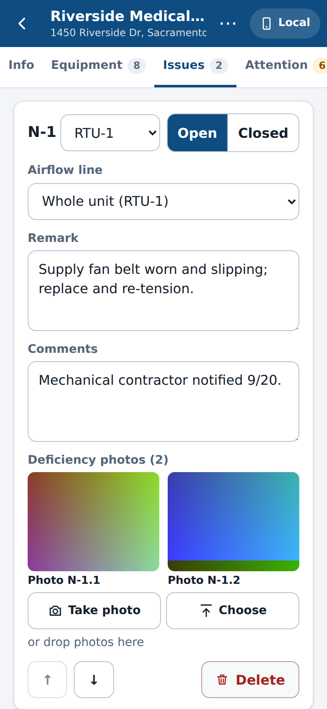

The **Issues** tab has two lists that feed two workbook sheets. They go to different parties, so they're numbered
separately:

| List | Numbered | Workbook sheet |
|---|---|---|
| **New equipment** | **N-1, N-2, N-3…** | Summary - New |
| **Existing equipment** | **E-1, E-2, E-3…** | Summary - (E) |

**Add new issue** or **Add existing issue**, then:

- **Deficiency / Observation**: a **deficiency** turns its unit red while open and goes on the Summary page. An
  **observation** is a note for the report that doesn't flag anything (e.g. "filters recently changed by owner"):
  numbered on its own (**Obs. N-1**, **Obs. E-1**), listed under each list's *Observations*, never counted as an
  open issue. **Add observation** starts one; switching an issue's type gives it the next number in the other list.
  Observations print in the Issues report (their own section) and, in the workbook, on the page after each Summary
  page's deficiencies (*Observations*, 20 lines; the page prints only when there are some). A re-issued rev 05 / 06
  workbook has no place for them (export warning).

- **Equipment**: pick the unit, or **General (N/A)** for a building-wide issue. In the workbook, a linked issue's
  remark starts with the unit, e.g. `RTU-1: Supply fan belt worn…`.
- **Airflow line** (when the unit has outlets, grilles or valve rows): **Whole unit**, or the one line the issue is
  about (an outlet, a grille, a valve). The workbook remark then names both: `RTU-1 · S-12: Balancing damper stuck`.
  A re-import links it to that line again.
- **Open / Closed**: an **open** issue turns its unit **red**. Close it when it's resolved.
- **Remark**: the deficiency, as it should read in the report.
- **Comments**: follow-up notes (e.g. "Mechanical contractor notified 9/20").
- **Deficiency photos**: **Take photo** / **Choose** (or drag and drop on a laptop). They're numbered to the issue:
  **Photo N-3.1**, **Photo N-3.2**, **Photo E-1.1**.
- **↑ / ↓** swaps an issue with its neighbor. Numbers and photo labels update everywhere.
- **Delete** removes the issue and its deficiency photos (it asks first).

The Issues tab count shows open deficiencies.

**Suggested deficiencies.** At the top of the Issues tab, every unit with readings outside tolerance and no issue
yet, e.g. *EF-12 (New): Registers / grilles 1 at 63 % and Registers / grilles 2 at 128 % of design, outside the ±10 %
tolerance.* **Add as deficiency** adds it pre-filled and linked to the unit (and to the line when there is only one);
edit the remark as it should read. **Not a deficiency** sets the unit aside for this project (for example when its
remarks explain it). Issues are never added on their own: only the ones on this tab go on the Summary pages.

**Issues and photos of one airflow line.** Each outlet / grille / valve row has, in its **Row…** menu, **Add issue
for this line** (the new issue opens on the Issues tab with the unit and the line already set) and **Add photo of
this line…** (for example the duct configuration at that outlet). The row then shows a red **⚑ N-4** chip for each
issue and **📷 2** for its photos; tap a chip to go to them. A line is named by its **No.** (`S-12`), a valve by its
tag, else by its table and position (`Supply outlets #3`). Deleting the row keeps its issues and photos on the unit.

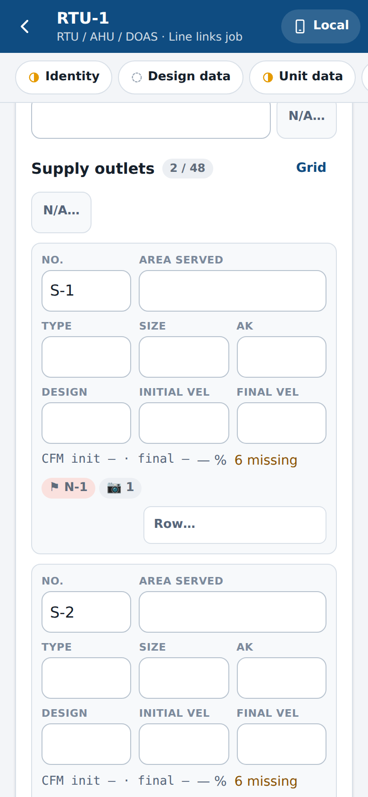

So there are three levels for both issues and photos: the **project** (General (N/A)), a **unit**, or **one airflow
line** of a unit.

---

## 7. Photos

### Taking photos

Every photo spot has **Take photo** (opens the camera) and **Choose** (camera roll or files; several at once where
it makes sense). On a laptop you can also drag photos in.

A unit's photo slots take **more than one photo** (two corners of a unit, the label from two sides): once a slot has a
photo, *Add more: camera or library* shows above its buttons (marked **+**) and both add to it; the extra photos show as small
thumbnails under the first and are numbered in the reports (*RTU-1 · Unit 1*, *Unit 2*). To remove one of several,
open it and tap **Delete**.

| Photo | Where | Required? |
|---|---|---|
| Cover | Info → Cover photo | Yes, or mark N/A |
| **Unit**, **Unit label / tag**, **Motor / nameplate**, **OA damper** | Each unit → Photos section | Yes, unless marked N/A. Motor / nameplate on RTUs, MAUs, ERVs, fans and pumps (the motor label, or the motor itself when it has no visible label); N/A with the motor data. OA damper only on units with OA. Small fans and VAVs: **Unit / tag**. Hoods: **Hood**, **Hood tag**. |
| Deficiency | Issues → the issue | Optional |
| Other / general | Photos tab → **Add photos** | Optional |

Photos are straightened (EXIF rotation), resized to a 2000-pixel long edge and saved as JPEG. That keeps them
sharp enough for the report while saving space. On iPhone, photos are converted from HEIC to JPEG as they're picked.
If a device ever says *This is a HEIC photo, which this browser cannot open*, set **Settings → Camera → Formats →
Most Compatible**.

### The Photos tab

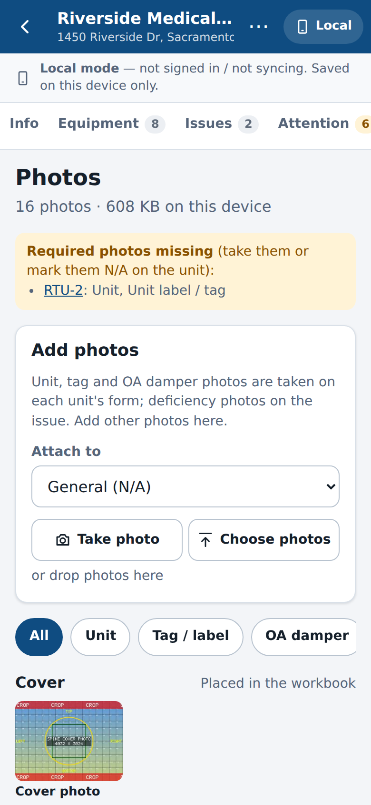

- **Required photos missing**: each unit that still needs photos, with a link to it. (Only units you've started.)
- **Add photos**: pick **Attach to** (a unit, or **General (N/A)** for a photo that isn't of one unit), then take
  or choose photos. Issues use the same words: an issue that isn't about one unit is linked to **General (N/A)**.
- Category filter chips, and thumbnails grouped by cover, unit, issue and general.
- Tap a photo to open it. There you can edit the **Caption**, change the **Category**, **Issue** or
  **Equipment** (and, for a unit photo, the **Airflow line**: labels then read `RTU-1 · Other · S-12`), move it **← Earlier** / **Later →** within its group, or **Delete** it.

### Storage on the phone

Photos are stored **inside the app on this device**, not in your camera roll, and not uploaded yet (cloud upload
comes with sync). The **Storage on this device** card shows how much space this project uses and whether storage is
**Persistent** (the device won't clear it to free space). If it says *Best effort*, make sure the app is installed
to the home screen and export the **Photos (.zip)** regularly.

Photos are **not** in the workbook, apart from the cover photo. They go into the Photo Report and the zip.

---

## 8. Exports

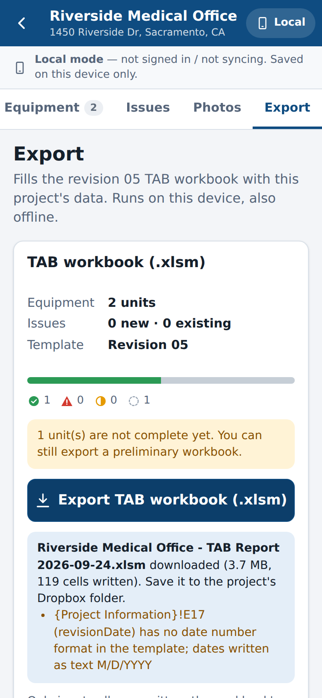

Everything on the **Export** tab runs on your device and works offline. Each export **downloads a file**. Nothing is
sent anywhere by itself.

### The TAB workbook (.xlsm)

1. **Export** tab → **TAB workbook (.xlsm)** card. It shows the equipment and issue counts, the template
   (**Revision 07**; an issued rev 05 / 06 workbook is re-issued in its own revision) and the status bar.
2. Check the **Revision** label. The app suggests **Prelim** first, then **Rev 1**, **Rev 2**… and you can type
   **Final** or anything else.
3. Tap **Export Prelim (.xlsm)** (the button shows the label).
4. The file `<Project> - TAB Report <date>.xlsm` downloads, and a box under the button confirms it.

You can export even when some units aren't complete. The app just notes that it's a preliminary workbook.

**The workbook comes out ready to print.** The export hides what the report doesn't use, as the *Print Report* macro
would: unit sheets with no units of their type (e.g. VAVs, Traverses), unused unit blocks, continuation pages with
nothing on them, empty outlet / grille rows, and the Equipment Summary and Building Balance lines of units the
project doesn't have. Printing or saving as PDF from Excel prints only the used pages. To fill in more by hand in
Excel, unhide the rows (select the rows around them → right-click → **Unhide**) or the sheet (right-click a sheet tab
→ **Unhide…**); the next export from the app sets it all again. The ToC page numbers still come from Excel
(*Print Report*, or the ToC button).

To send out the report *and* freeze the data, use **Issue report as Prelim** instead (see
[section 10](#issue-the-report-lock)). The plain **Export** button never locks anything, so use it for working copies
and daily backups.

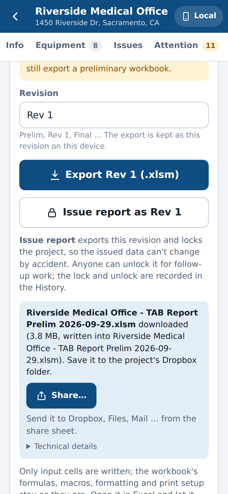

**Share… (phones).** Where the phone can share the file, the confirmation box has a **Share…** button. It opens the
phone's share sheet, so you can send the file straight to **Dropbox** (or Files, Mail, Teams…) without looking for
it in Downloads. iPhone and iPad can share every export (workbook, PDFs, zip). Android's Chrome can share the PDF
reports but not the `.xlsm` or `.zip` files. For those, and on laptops, the box shows **Download again** instead,
and you save the downloaded file as below.

The box also has a collapsed **Technical details** line (the number of cells written, and notes from the workbook
writer). You don't need it; it's there in case support asks.

Each export is kept as a **revision** in the **Revisions** list at the bottom of the tab, with its label, date and
size. You can download any of the newest 5 again from there. Older ones keep only their values, which is enough for
re-import. **The copy you saved to Dropbox is the official record.**

### Saving to Dropbox

The app has no Dropbox connection. You save the file yourself:

- **iPhone/iPad:** tap **Share…** in the export box → **Dropbox** (or **Save to Files** → **Dropbox**) → the project
  folder. Missed it? **Files** app → **Downloads**.
- **Android:** **Dropbox** app → **+** → **Upload files** → **Downloads** → the file. (Or share it from the download
  notification to Dropbox.)
- **Laptop:** move it from **Downloads** into the project's Dropbox folder.

### Opening it in Excel (macros)

The workbook is a macro-enabled `.xlsm` (for example, the table-of-contents button). The app only fills input cells.
Formulas, macros, formatting and print setup are left as they are.

- Open it in **desktop Excel**. If a yellow bar says **Macros have been disabled**, click **Enable Content**.
- If a red bar says Microsoft **blocked macros** because the file came from the internet, close the file,
  right-click it → **Properties** → tick **Unblock** → **OK**, and open it again.
- Let Excel recalculate on open. If it asks to save changes when you close, that's normal.
- Excel on a phone can show the workbook but won't run macros.

**Pages and page breaks.** Every sheet opens in **Page Break Preview**. Each unit starts on its own page, and the
print scale leaves a little room on every page, so the breaks land in the same place on every laptop and printer
(Excel adds its own break when a page is a hair too tall for a printer, which used to shift everything after it by a
row). Don't drag the blue break lines; if a page looks off, tell us which sheet. Footers read **Page x of N**,
counted over the whole printed report (Print Report prints every sheet in one go).

**The NEBB stamp** is part of the template (the Certification sheet's stamp box). If a stamp image is set on the
**Certification profile**, exports use that one instead (when the stamp is renewed each year, update it there).

**NEBB certificates** (the *NEBB Cert* and *NEBB Frm Cert* sheets) print upright, two to a page: the three individual
certificates on two pages and the firm certificate on its own page. When a certificate is renewed, replace its picture
in Excel (right-click → *Change Picture* → *From a File*) so it keeps its place and size.

**Linked cells look blank?** The workbook is saved without calculated values, so Excel works them all out when it
opens the file. Everything the report pages take from **{Equipment Data Entry}** (designations, design data,
Building Balance) is a formula. Until Excel calculates, those cells are empty. Excel doesn't calculate in:
- **Protected View** (the yellow *PROTECTED VIEW* bar on a downloaded file): click **Enable Editing**;
- previews (the phone, Dropbox, Outlook, the Claude app): open the file in desktop Excel.

**Stop unblocking every file.** Windows marks files that come from a browser download or an email as *from the
internet*. That's why Excel opens them in Protected View and blocks their macros. The mark is added on your computer,
so a workbook can't arrive without it. Set your computer up once instead:
1. **Trusted Location (recommended).** In Excel: **File → Options → Trust Center → Trust Center Settings → Trusted
   Locations → Add new location**. Pick the folder you keep TAB workbooks in (for example the Dropbox projects
   folder), tick **Subfolders of this location are also trusted**, then **OK**. Workbooks opened from there skip
   Protected View and their macros run, even if they came from the internet. Move downloaded workbooks into that
   folder before opening them. For a network drive, also tick **Allow Trusted Locations on my network**. IT can
   set the same location for everyone with Group Policy.
2. **Or unblock a whole folder at once** (Windows PowerShell; change the path to your folder):
   `Get-ChildItem "$env:USERPROFILE\Dropbox\TAB Projects" -Recurse -Include *.xlsm | Unblock-File`
3. Files that arrive through the **Dropbox desktop app**'s sync (not a browser download) usually don't carry the
   mark.

### Photo and Issues reports (PDF)

On the same tab, **Photo and Issues reports (PDF)**:

- **Report label**: the same as the workbook revision by default.
- **Photos per page**: **4 per page (2 × 2)** (standard), **2 per page (large)** or **6 per page (2 × 3)**.
- **Issues to include**: **All**, **New only** or **Existing only**. New and existing go to different parties, so
  you can export each on its own.
- **Include deficiency photos in the Photo Report**: tick or untick.

| Button | What you get |
|---|---|
| **Photo Report** | Photos grouped by unit, then General, each with its label (e.g. *RTU-1 · Unit*) and caption |
| **Issues Report** | New and / or Existing sections. Each issue shows its number, unit, OPEN / CLOSED, remark, comments and its deficiency photos underneath |
| **Issues + Photos** | The Issues Report followed by the Photo Report |
| **Photos (.zip)** | All photo files, named like `RTU-1 - Unit - 01.jpg`, `Issue N-3 - 1.jpg`, `Cover.jpg` |

Large reports take a moment. The button shows *Placing photo 12 of 80…* while it works. When it's done, the box
under the buttons names the file and offers **Share…** (or **Download again**), like the workbook. Save these to
Dropbox the same way.

---

## 9. Follow-up: re-importing an issued workbook

After a prelim goes out, the office often polishes remarks and fixes formatting in Excel. Re-import brings those
edits back into the app, so the next export includes them **and keeps the Excel formatting**.

### The workflow

1. **Export** the report (e.g. *Prelim*) and save it to Dropbox.
2. The office **edits the workbook in Excel**: remarks, comments, formatting, the occasional corrected reading.
   Save it as `.xlsm`.
3. Back in the app: **Export** tab → **Re-import workbook** → **Choose .xlsm file** → pick the edited file (from
   Files / Dropbox on a phone).
4. **Review changes** (below), then **Apply**.
5. Do the follow-up work in the app.
6. **Export Rev 1**. The app writes **into the issued workbook** instead of a blank template, so the Excel formatting
   carries forward. The Export card shows **Written into** with that file's name.

Use **Use the blank template instead** only if you want to start from a clean template again. Hand formatting is
then not carried over.

### The review screen

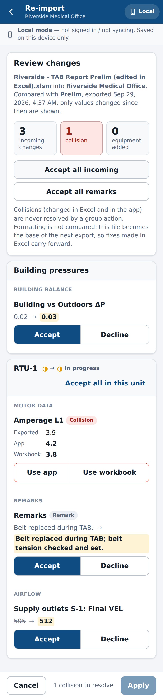

The app compares three versions: what it exported, what's in the app now, and what's in the file. It only shows
values that changed since that export.

- **Incoming change**: changed in Excel only. Shows old → new, **Accept** (the default) or **Decline**.
- **Collision**: the same value changed **in Excel and in the app** since the export. It shows the *Exported*,
  *App* and *Workbook* values, and you must pick **Use app** or **Use workbook**.
- **Remarks** are tagged *Remark*.
- Group buttons: **Accept all incoming**, **Accept all remarks**, **Accept all in this unit**. They never settle
  collisions for you.
- Each unit shows its color before and after the merge.
- Units removed in Excel are **declined** by default. Accept them only if you really want them deleted.
- **Apply** turns on once every collision is resolved. **Cancel** changes nothing.

Formatting is never compared, so it never shows up as a change or a collision. Photos stay as they are.

### Importing a workbook the app doesn't know

**Projects → Import workbook** (or a file exported from another device): if the file isn't linked to a project on this
device, choose **Create new project** or **Compare with project…**. A new project made this way has all the readings,
but **no photos** (photos aren't in the workbook), so units come back amber until photos are added.

---

## 10. Review, issuing the report, and History

### Review and sign-off (blue)

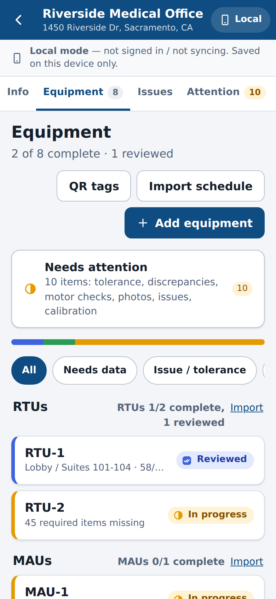

Anyone can sign off a **complete (green)** unit:

1. Open the unit. The status card at the top has a review line under the progress bar.
2. Type your name in **Reviewer name** (only the first time; the device remembers it) and tap **Mark reviewed**.
3. The unit turns **blue** (*Reviewed*), and the line says *Reviewed by Dana Ruiz · Sep 24, 2026, 3:10 PM*.

Until the unit is green, the line says *Can be marked reviewed once complete (green)*.

Where you see it:

- Unit cards and badges turn blue; the progress bars have a blue part.
- Counts: *RTUs 5/8 complete, 3 reviewed* on each type heading, *12 of 20 complete · 3 reviewed* on the Equipment
  tab and the project card, and *Reviewed: 3 of 20 units (2 complete, not reviewed)* on the Export tab.
- Filter chips **To review** (complete, not reviewed yet) and **Reviewed** on the Equipment tab.

**The review clears itself** when the unit changes after the sign-off: any field, N/A mark, New / Existing, an
outlet or filter row added, edited or removed, or a photo added or removed (also through a schedule import or a
re-import). The unit goes back to green and needs a new review. The History shows *Review cleared automatically
(the unit changed)*. Changes elsewhere in the project (tolerance, scope, other units) don't clear it.

If an **issue is opened** on a reviewed unit, the unit shows **red**, not blue, until the issue is closed. The
review line then says *Reviewed by … but the unit is no longer complete*. **Clear review** removes a review by hand.

### Issue the report (lock)

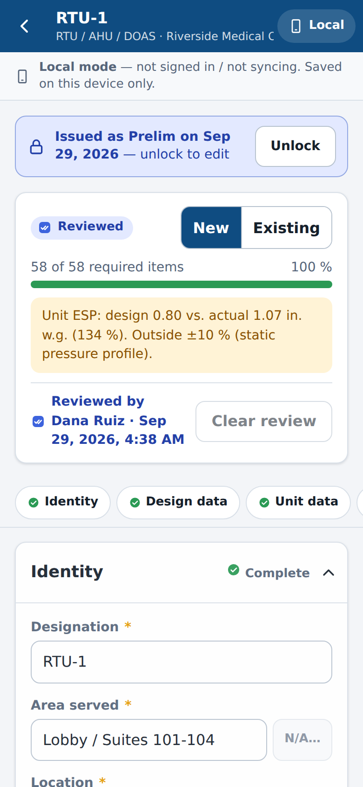

When a revision goes out (to the engineer, the GC…), issue it from the **Export** tab:

1. Check the **Revision** label (e.g. *Prelim*, *Rev 1*, *Final*).
2. Tap **Issue report as Prelim**, and confirm.
3. The workbook is exported and downloaded as that revision (like **Export**), marked **Issued** in the Revisions
   list, and the project is **locked**.

While the project is locked:

- Every project page shows the banner **Issued as Prelim on Sep 24, 2026 — unlock to edit** with an **Unlock**
  button, and the project card on the Projects screen shows a lock chip with the label (e.g. 🔒 *Prelim*).
- Forms are read-only (Info, units, Issues, Photos). **Add equipment**, **Import schedule** and **Re-import
  workbook** are hidden or blocked.
- You can still **export** (a copy of the workbook) and make the **PDF reports** and the **Photos (.zip)**, and you
  can view photos from the Photos tab.

**Unlock for follow-up** (the banner's **Unlock**, or the link on the Export tab): the confirm names the issued
revision and the label the next export will suggest, e.g. *Rev 1*. Anyone can unlock. The lock and the unlock
(who, when) are recorded in the History.

### History

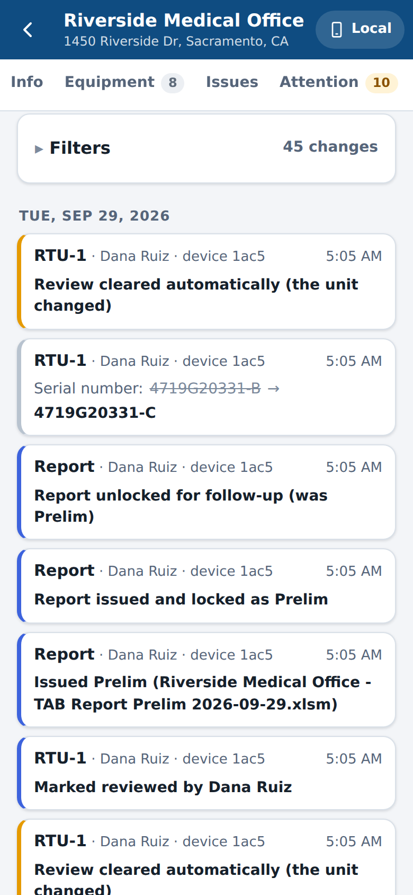

The **History** tab lists every change made to the project **on this device**, newest first, grouped by day:

- Edits read *Field: old → new*, e.g. *Serial number: 4719G20331-B → 4719G20331-C* or *Supply outlets S-2: Final
  VEL: 850 → 910*. Each line shows the unit (or *Report* / project), the person and device, and the time.
- Events: *Marked reviewed by Dana Ruiz*, *Review cleared automatically (the unit changed)*, *Report issued and
  locked as Prelim*, *Report unlocked for follow-up (was Prelim)*, *Issued Prelim (file name)*, re-imports.
- **Filters** (tap to open): **Unit** (or *Project-level only*), **Field** (text, e.g. *Final VEL*), **From** /
  **To** date, **User / device**. **Clear filters** resets them. The line shows how many changes match.
- **Show more** loads older entries.

Each unit page also has a **History** section at the bottom (**Show (N)**) with that unit's own changes, and a link to
the History tab filtered to the unit.

The history is kept on the device for **12 months** (at most 5,000 entries per project) and is deleted with the
project. With cloud sync, changes made on other devices appear too, e.g. *RTU-1 · Serial number … · Dana Kim · Phone*:
the person who signed in and the device's name (see *Name this device* below).

---

### Report check

The **Export** tab starts with the **Report check**: what a reviewer looks at before a report goes out, the same rules
every time, each line linking to the unit or page to fix:

- **Report content (NEBB 5.2):** narrative; TAB and report dates (the report not dated before the test); the
  certification lines, not expired at the report date, signed and dated on a final report; the stamp and signature
  images; every listed instrument calibrated within 12 months before the TAB date.
- **Units:** every unit complete (a *must fix* on a final report); reviewed before a final report; no two units of a
  type with the same designation, no repeated row numbers.
- **Remarks:** every unit with a reading out of tolerance has a remark or an issue explaining it; no working math left
  in a unit's remarks ("516 = 1484", a column of numbers): move it to the unit's field notes.
- **Electrical:** measured voltage within ±10 % of the rated voltage; voltage imbalance at most 2 %.
- **Values:** readings outside a plausible range (a typo such as 85 in. w.g. or 25,000 fpm).
- **Hydronic:** a valve recorded wide open per system, memory stops set, pumps and valve systems named alike, the VFD
  setpoint recorded.
- A summary of the **Attention** tab.

**Issue report** mentions the *must fix* count in its confirmation. **Projects → Check a workbook without importing it**
runs the same check on any a2b revision 05 or 06 workbook (another tech's report, or one to review); nothing is saved
(unit completeness is left out there: photos are not in a workbook).

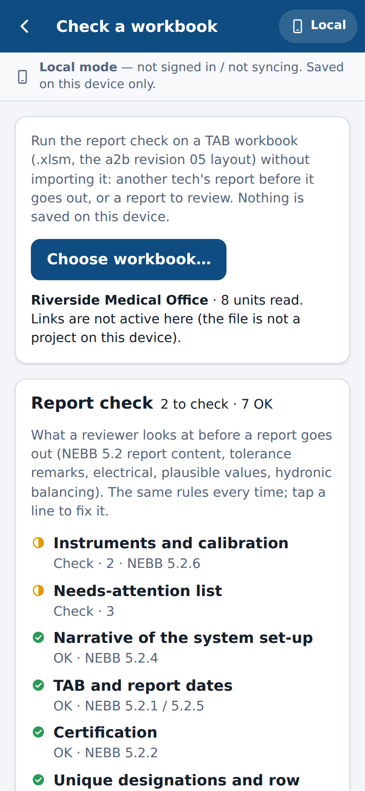

**Spelling.** Under the Report check, **Check spelling** checks the text that prints (narrative, Building Balance
notes and pressure remarks, unit remarks, areas served, locations, final settings, airflow lines' areas, issues)
against an English dictionary plus trade and manufacturer words. Acronyms and tags (CFM, VFDs, RTU-1, 8x8) are
skipped. Each word shows suggestions and links to where it is typed; **Ignore** adds it to this project's word list.
The dictionary comes with the app, so it works offline. Typing in a field also gets the device's own spell check.

### Final report with the figures

The figures can go **into** the report, each one next to what it supports:

1. In Excel, run **Print Report** and save the PDF (it hides unused units, updates the table of contents and prints
   every page; footers read *Page x of N*).
2. In the app, **Export → Final report (pick the Excel PDF)** and pick that PDF.

The app adds its figures and downloads *<project> - TAB Report <label> <date>.pdf*:

- each unit's **static pressure profile** right after that unit's pages (after the continuation page when it prints
  one), each **traverse**'s figure after the Traverses page that holds it, pump curves after the pump's page;
- the **summary** page after the Building Balance;
- every page numbered **Page x of N** over the whole report (the cover stays unnumbered), and the **table of contents**
  page numbers moved to match;
- **Include outlet / valve charts** adds the design-vs-actual bar charts to each unit's figures (off by default: the
  unit page already lists the outlets, coloured by tolerance).

A unit the app can't find in the PDF (renamed in Excel, for example) gets its figures after the last page of its sheet;
one with no sheet at all, at the end. The note under the button says how many were placed and lists any at the end.
Re-run Print Report after editing the workbook, then make the final report again.

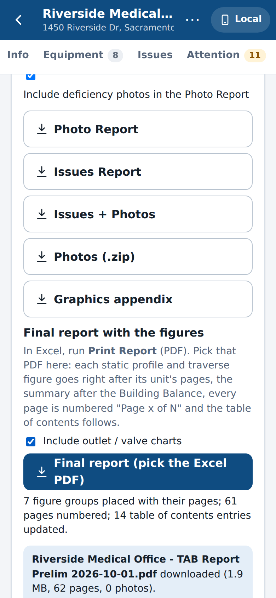

### Graphics appendix

**Export → Graphics appendix** downloads a PDF of figures drawn from the project, to send with the report. Units
without readings are left out.

- **Summary** (first page): units complete, airflow / water lines within the tolerance (per equipment type), open
  deficiencies, static profiles with ESP within ±10 % of design, uneven traverses, and the building balance: outside
  air and exhaust, design against actual, with the engineer's air balance marked when it was imported, the net, and
  the measured building pressures.
- **Static pressure profile**, per unit: the unit drawn as a cabinet (dampers, filter, wheel, coil, heat / burner,
  fan, discharge duct), each static tap with its reading, the ΔP across every component, and a chart of the statics
  through the unit (suction below zero, discharge above) with the fan's rise (TSP). Tiles give the TSP, the ESP
  against design (a gauge with the ±10 % band) and the unit ΔP inlet to fan.
- **Duct traverse**, per traverse:
  - **rectangular**: the duct face to scale with its dimensions, every point coloured by velocity (a legend with the
    average), the points more than 25 % from the average outlined in red;
  - **round**: the duct with its equal-area rings and both diameters, the points at their real positions, and the
    readings of each diameter in a coloured table;
  - **flat oval**: the flat part as a coloured grid between the two half circles, the end points on the centre
    line, the average weighted by area;
  - a **velocity profile** across the duct (one line per diameter or per row), the average, the airflow against
    design, the spread (coefficient of variation: 10 % or less is even, over 20 % uneven), and the location check:
    how many readings have a velocity pressure of at least 1/10 of the highest. Under 75 % marks a poor traverse
    location (the usual field-test criterion).
  - the **conditions at the traverse**: duct static pressure (in. w.g.) and air temperature (°F), from the
    traverse's *Conditions* section (its N/A notation when marked, *not recorded* when blank).
- **Outlet / valve charts**: design vs. actual for every outlet table and valve system, with the tolerance band.
- **Pumps**: design and operating point, and the pump curve with the pump-curve library.

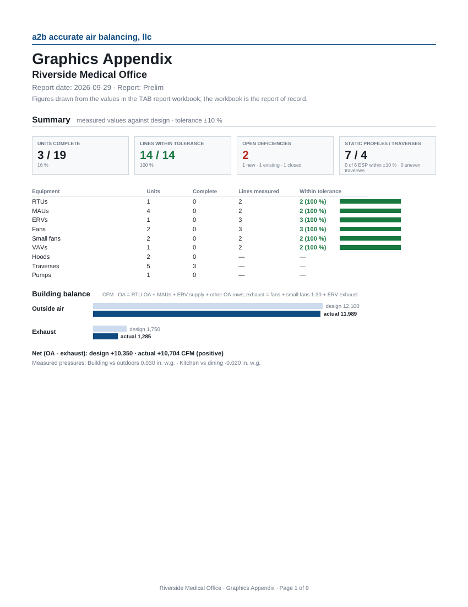
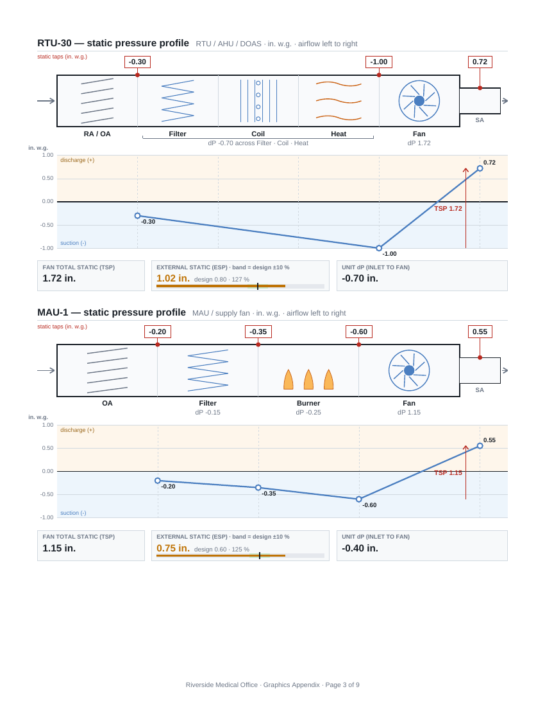
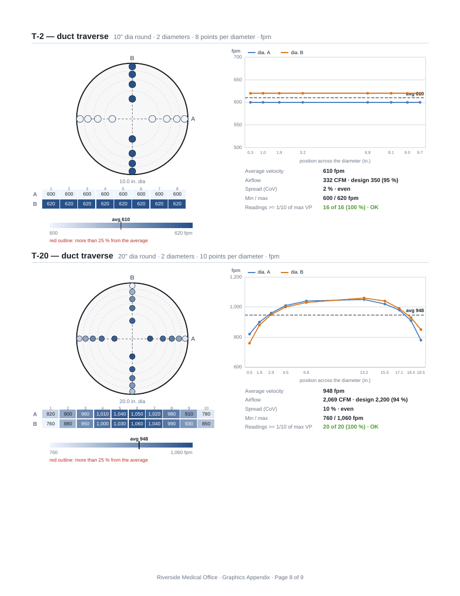

### Tolerance colours in the workbook

Every export colours the workbook's **% of design** cells: outlet and inlet rows, unit totals, the Equipment
Summary, the Building Balance and the hood sheets. **Green** is within the project's tolerance (Info → Tolerance, ±10 %
by default), **red** outside. The colours are conditional formatting, so they follow the values when you change a
reading in Excel. A re-export replaces them, including when the tolerance was changed.

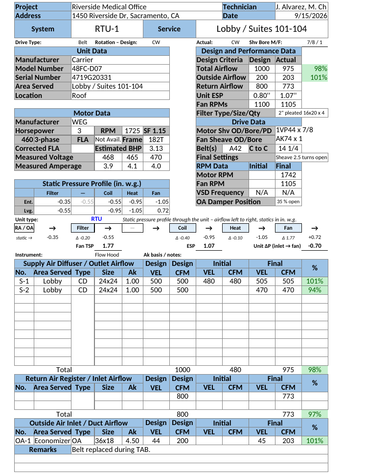

## 10b. Hydronic: pumps, balancing valves, plant

Hydronic work goes in the same project and produces a **separate workbook** (the hydronic TAB report, H01). The
project information, remarks, calibration and certification are shared with the airside report.

**Add equipment → Hydronic:**

- **Pumps**: the schedule (design flow, head, motor), the final flow and the **pump test** in psi at the gauges:
  pump off (standing pressure), shut-off, wide open and final suction / discharge. The app shows the head at each
  condition ((discharge − suction) × 2.31, adjusted for specific gravity and the gauge height difference), final head
  vs. design and flow vs. design, and warns when the head is well above design. Motor data and readings are the same as
  on a fan (corrected FLA, BHP). An **integrated variable-speed** pump needs no shut-off test (NEBB 5.3.14).
- **Valve systems**: one per system (CHW, HW …). The system's name is its designation: name each pump's **System**
  the same, and the System Summary adds pumps and valves up by it. Each valve row: tag, what it serves, make / model,
  size, type (F fixed / A adjustable / S self-adjusting), design, initial and final GPM, setting, ΔP, wide open. A final
  flow outside ±10 % of design turns the row red. Set **Memory stops set / valves marked** once the final settings are
  in.
- **Plant equipment**: chillers, cooling towers, boilers and heat exchangers: design and actual flow and ΔP per water
  circuit (a water-cooled chiller has evaporator and condenser; single-circuit units need only circuit 1).
- **Flow readings**: ultrasonic readings (pipe, transducer, design and measured flow).

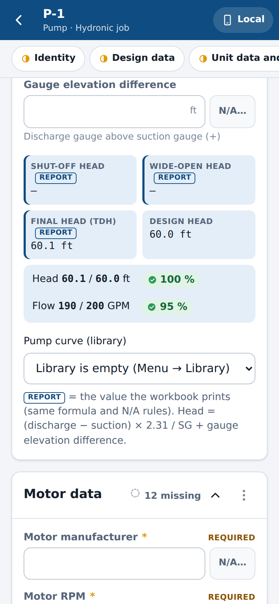

**Balancing assistant** (valve system → *Balancing and final settings*): with every valve open, enter each valve's
**Initial** flow. The panel lists the valves lowest % of design first: the first is the **reference** (leave it wide
open); every other valve gets a **target** flow (its design × the reference's %) to throttle it to, next-lowest first
(NEBB's proportional method). Re-read the reference as you go. Then set the pump so every valve is at design ±10 %,
enter the **Final** flows and mark the wide-open valve(s): the panel shows **Balanced** when every final is in tolerance
and a valve is recorded wide open.

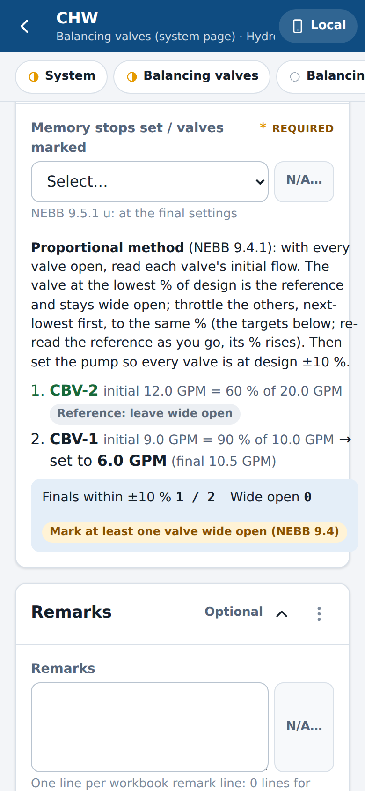

**Valve library** (**Library** page, under the calibration library): enter a valve model once from the manufacturer's
data sheet: make, model, size, type, and either its **Cv table** (one line per setting: *setting Cv*; a fixed orifice:
just its Cv) or, for a self-adjusting valve, its tag flow and ΔP control range. Name the data sheet. On a valve row,
pick it under **Library valve**: the row takes the make / model, size and type, and once the setting and ΔP are in it
shows the flow (Cv × √ΔP in psi; a ΔP in ft w.g. is converted, set **ΔP measured in** on the system) with **Use as
initial** / **Use as final**. The app interpolates between the table's settings and never extrapolates. Shared with
the team when signed in.

**Pump curve library** (**Library** page, under the valve library): enter a pump once from the manufacturer's curve
sheet: make, model, size, the curves' speed, and one curve per impeller diameter (**Add impeller curve**; one line per
point, *GPM head*, starting at shut-off). Name the curve sheet. On a pump, pick it under **Pump curve (library)** in
the pump-test panel: with the shut-off gauges read, the app estimates the impeller (between the two catalogue
impellers whose shut-off heads bracket the reading) and, with the final gauges, the flow at the final head. It
corrects the curves to the **Actual RPM** when entered (affinity laws) and never extrapolates. **Use impeller** /
**Use as actual GPM** (the flow method becomes *Pump curve*) write the estimates; nothing changes until you tap. The
graphics appendix draws the curve with the design and operating points.

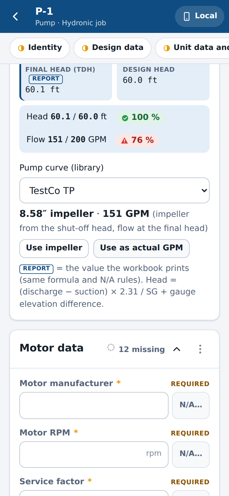

**Export → Hydronic workbook** (shown when the project has hydronic units) downloads it. It is written into the blank
hydronic template each time (no re-import yet); issuing and locking the report stays on the airside workbook.

## 11. Coming later

> **Later: Microsoft sign-in and cloud sync.** You'll sign in with your company Microsoft account. Projects and
> photos will then sync between devices and teammates, and the **Local mode** banner will go away. Until then, data
> stays on each device, so keep exporting.

---

### Name this device (with cloud sync)

After you sign in, a yellow banner asks **Name this device**: tap **Phone**, **Tablet**, **Laptop** or **Desktop** (or
type something like *Dana's iPad*) and **Save**. The History on every device then shows who made a change **and on
which device**, e.g. *Dana Kim · Phone* instead of *device 3f9a*. Change it later in **Sync & account → This device**.

**Your account:** the round button at the top right (your initials) opens **Sync & account**: who is signed in, this
device's name, **Sync now** and **Sign out**. A yellow dot on it means something needs doing (sign in, or name this
device). The status pill next to it (cloud icon) opens the same page.
The name is kept on the device (not in your account), so each device is named once.

### Pausing sync

Sync runs by itself whenever the device has a signal. To stop it on one device (weak or metered signal, saving
battery, or not wanting a teammate's edits arriving mid-test), use **Sync & account → Pause sync**. Everything keeps
working and every edit is saved on the device; nothing is sent or fetched. The pill shows **Paused · N not sent**.

- It stays paused after the app is closed and reopened, until you tap **Resume sync**.
- **Sync now** still sends and fetches once (for example back at the truck) and stays paused.
- **Resume sync** syncs straight away and then as usual.
- While paused, your edits are not backed up and the team doesn't see them. If sync has been paused for more than a
  day with changes waiting, a banner says so, with a **Resume sync** button.
- Two people changing the same value meanwhile shows up as a conflict after you resume, the same as after a long time
  without signal.

### Signing out on a shared device (with cloud sync)

**Sync & account** (tap the status pill) → **Sign out** keeps your projects on the device; nothing syncs until someone
signs in again. On a shared or borrowed phone or laptop, use **Sign out and remove data from this device** instead: it
signs out and deletes every project, photo and setting from that device. What has synced stays in the cloud and comes
back when you sign in again. The app warns you first when something would be lost for good: changes that haven't synced
yet (cancel, tap **Sync now** while online, then try again) and projects kept on this device only (export them or move
them to the cloud first).

### Two phones adding a unit at the same time (with cloud sync)

If you and a teammate each add, say, an RTU while you can't see each other's changes (offline, or just before the next
sync), both phones can give the new units the same workbook block. The app fixes this by itself when they sync: the
unit that reached the cloud first keeps the block, the other moves to the next free one, on every device. Its page
shows *Moved from workbook slot 3 to slot 4 because another device used slot 3 for RTU-7* (tap **OK** to hide it), and
the History says so. If the workbook has no free block of that type left, nothing moves: the **Attention** tab lists
the two units, and only the first is exported until you delete one.

### Two people changing the same thing (with cloud sync)

Different fields merge by themselves. When two phones change the **same** field before either has synced, the later
change is kept everywhere and the **Attention** tab lists a **Conflict** with both values: tap **Keep current** or
**Use "…"** for the other value. The field shows a small flag until then.

- **Something was deleted while you were editing it.** If a teammate deletes a unit (or an outlet row, issue or
  instrument) while your phone still had changes to it, the delete wins, and your Attention tab shows *RTU-3 ·
  deleted* with what went with it. **Keep deleted** closes it; **Restore** brings it back as a new record with your
  latest values (a unit takes the next free workbook block if its own is taken; photos only when the file is on your
  phone). The phone that deleted it sees a similar card; once one of you restores it, the other card closes.
- **Instrument library.** A conflict on a library instrument shows on the Attention tab of every project that uses it,
  on the **Library** page, and as a number on the *Library* button on the Projects page.
  Resolving it once resolves it everywhere.
- **Reviews.** A review signs off what you saw. If a teammate changed the unit before your review reached the cloud,
  the review is cleared (History: *Review cleared automatically (the unit changed on another device …)*). Check the
  unit again and mark it reviewed once it's still green.

---

## 12. Troubleshooting and FAQ

**I lost signal. Did I lose anything?**
No. Everything saves on the device as you type, and the app keeps working offline, including export. The banner
adds *· offline*.

**I cleared my browser data / deleted the app / reset the phone. Where are my projects?**
Gone from that device. Clearing website data or removing the home-screen app **erases the projects on it**. There's
no cloud copy yet. Recover the project from your last exported workbook with **Projects → Import workbook**. Photos
come back only from the **Photos (.zip)** (add them again by hand). **This is why you export every day.**

**The project isn't on my other phone / the office laptop.**
Normal in Local mode. Each device has its own data. Send the exported workbook and import it on the other device.
Only one person should keep working on a project's data at a time until sync is live.

**"Storage full", or photos won't save.**
Free up space on the device (old videos and apps), then try again. Each project's workbook revisions take up to about
25 MB, plus the photos. Export and save finished projects, then delete them on the phone (**⋯ → Delete
project…**; signed in, this deletes them for everyone, so only when the project is done).

**The Photos tab says storage is "Best effort".**
The device may clear app data when it runs low on space. Install the app to the home screen (iPhone: from Safari)
and export the photos regularly.

**The app looks old / a fix isn't showing up.**
Tap **Check for updates** at the bottom of the project list, then **Reload** on the *Update available* bar. If it says
it's the latest version, compare the **version** line with another device; close the app fully (swipe it away) and
open it again if they differ.

**I can't edit anything, and there's a blue "Issued as …" banner.**
The report was issued, so the project is locked. Tap **Unlock** in the banner when you start follow-up work.

**A unit was blue yesterday and is green today.**
Someone changed the unit after it was reviewed, so the review was cleared. The **History** shows what changed. Review
it again.

**Excel says macros are disabled or blocked.**
See [Opening it in Excel](#opening-it-in-excel-macros): **Enable Content**, or **Properties → Unblock** for a
downloaded file. A **Trusted Location** for your TAB folder stops this for good.

**The report pages are blank but Equipment Data Entry is filled in.**
The file is in Protected View or a preview, so Excel hasn't calculated it yet. Click **Enable Editing** in desktop
Excel (see [Opening it in Excel](#opening-it-in-excel-macros)).

**Why is this unit red when everything is filled in?**
It has an open issue, or a reading is outside the tolerance. The red box at the top of the unit says which. Close
the issue, or re-check and correct the reading.

**Why is it still amber?**
Tap **Show missing** at the top of the unit. Usually it's a required photo, an instrument, or a field that should
be marked N/A.

**Can I leave a field blank if it doesn't apply?**
No. Mark it **N/A**, **Not Avail.** or **Not Acc.** Blank means "not done" and prints blank.

**I can't add another unit.**
That type is at the workbook's capacity (e.g. 10 MAUs). Remove an unused one.

**The export box has "Technical details". Do I need them?**
No. They're notes from the workbook writer (for example, that a date was written as text). The workbook is fine.

**Where's the Share… button?**
It appears only where the device can share that kind of file: every export on iPhone / iPad, PDF reports on Android.
Elsewhere you get **Download again**; save the file from Downloads.

**Where did my download go?**
iPhone: **Files → Downloads**. Android: **Files → Downloads**. Laptop: the **Downloads** folder.

**Does the Photo Report go in the workbook?**
No. Only the cover photo is in the workbook. Unit and deficiency photos go in the PDFs and the zip.

---

## Field cheat sheet

**Before you leave the office:** open the app once with a connection. Check the project exists on *this* device.
Check the instruments' calibration dates (Info).

**On site, per unit**

1. **Equipment → tap the unit** (or **+ Add equipment** / **Duplicate**).
2. **New / Existing** set correctly.
3. Identity → design → nameplate → motor (volts / amps each leg) → drive → RPM → statics → airflow.
4. **Instrument** picked on every airflow section.
5. Photos: **Unit**, **Unit label / tag**, **OA damper**. Each one taken, or **N/A…**.
6. **Show missing** → fill or mark N/A until it's **green**.
7. Red? Check the tolerance callout, or the open issue.

**N/A menu**

| You see | Mark |
|---|---|
| Doesn't apply | **N/A** |
| Can't read it / nameplate gone | **Not Avail.** |
| Can't get to it | **Not Acc.** |
| Whole section doesn't apply | Section **⋮ → Mark section N/A** |
| Whole unit not tested | **Whole unit N/A** (bottom of the page) |

**Quick tips**

- **Add outlet** copies area / type / size / Ak down. Just enter design and velocities.
- MAU: pick **Method used** first. Only that method is needed.
- Hood: pick **Filter type** first. VelGrid = 1 reading, Airfoil = 3.
- Traverse: enter the duct size first, then type readings and press **Enter** to jump point to point.
- Amber boxes (BHP, amps, ESP) are warnings to double-check, not errors.

**Issues**

- **Add new issue** (N-#) or **Add existing issue** (E-#), then pick the unit or **General (N/A)**.
- Deficiency photo on the issue: **Photo N-3.1**.
- An open issue makes its unit red. Close it when it's fixed.

**End of day (every day)**

1. **Attention** tab: work through what you can.
2. **Export → Export Prelim (.xlsm)** (or the next Rev). The project card should then say *no changes since*.
3. **Share… → Dropbox** (iPhone), or save it to the project's **Dropbox** folder.
4. **Photos (.zip)** too, if you took new photos.

**Sending out a report:** review the units (blue), then **Export → Issue report as …**. **Unlock** for follow-up.

**Never:** clear browser data, delete the app, or reset the phone without exporting first. In Local mode, that's the
only copy.
